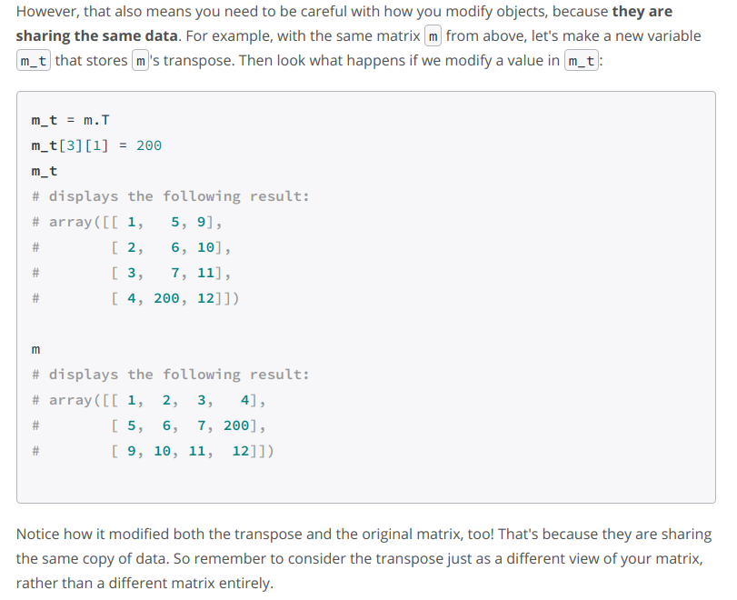

# Introduction to Deep Learning

### Brief guide to NumPy

* Scalars have zero dimensions.

* Tensorflow, an open source software library for high performance numerical computation, deals with all its data in form of tensors. **Tensor refers to any n-dimensional collection of values.** So scalar is a zero-dimensional tensor, vector is a one-dimensional tensor, matrix is a two-dimensional tensor.

* Python is convenient, but slow. But it allows us to access libraries that execute faster code written in languages like C. NumPy is one such library: it provides fast alternatives to math operations in Python and is designed to work efficiently with matrices.

* Let's import the NumPy library,and as a convention name it as np, so that we can use the library by prefixing the names of functions and types with *__np.__* 
&nbsp; &nbsp; &nbsp;&nbsp; &nbsp; &nbsp; &nbsp;&nbsp; &nbsp; &nbsp;**import numpy as np**

 * The most common way to work with numbers in NumPy is through ndarray **(ndarray is a class)** objects.A numpy array is a grid of values, *all of the same type*(A list is the Python equivalent of an array, but lists can contain elements of different types), and is indexed by a tuple of nonnegative integers. The number of dimensions is the rank of the array; the shape of an array is a tuple of integers giving the size of the array along each dimension.

 * Further Notes 

 * NumPy supports several types of matrix multiplication:
   * Element-wise Multiplication -- We do this using the * operator.
   * Matrix Product-- Use NumPy's **matmul** function.
   * NumPy's **dot** function -- It turns out that the results of dot and matmul are the same **only if** the matrices are two dimensional.

 * To get the transpose of a matrix(matrix is object from ndarray class) simply access its **T** attribute. NumPy does transpose without moving any data in memory - it simply changes the way it indexes the original matrix - so it’s quite efficient.  
 **Be very Careful** 
