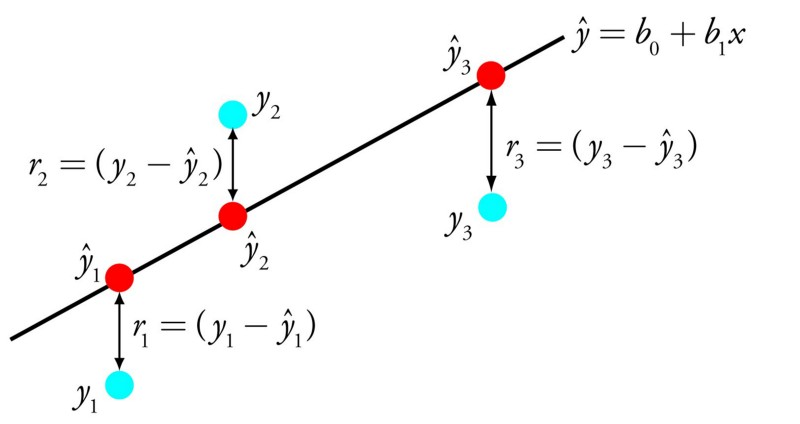

### Machine learning Algorithms

The most common type of machine learning is to learn the mapping Y = f(X) to make predictions of Y for new X. This is called predictive modeling or predictive analytics and our goal is to make the most accurate predictions possible.  
There’s something called the “No Free Lunch” theorem in machine learning. In a nutshell, it states that no one algorithm works best for every problem, and it’s especially relevant for supervised learning (i.e. predictive modeling). For example, you can’t say that neural networks are always better than decision trees or vice versa. 
**However**, there is a common principle that underlies all supervised machine learning algorithms for predictive modeling:
> **Machine learning algorithms are described as learning a target function (f) that best maps input variables (X) to an output variable (Y): Y = f(X)**

This is a general learning task where we would like to make predictions in the future (Y) given new examples of input variables (X). We don’t know what the function (f) looks like or its form. If we did, we would use it directly and we would not need to learn it from data using machine learning algorithms.

Top machine learning algorithms used by data scientists:
 1. **Linear Regression** -- The representation of linear regression is an equation that describes a line that best fits the relationship between the input variables (x) and the output variables (y), by finding specific weights for the input variables called coefficients ($b_{i}$). 
 The goal of the linear regression learning algorithm is to find the values for the coefficients $b_0$ and $b_1$, then using the model learnt we will predict y given the input x. 
Different techniques can be used to learn the linear regression model from data, such as a linear algebra solution for ordinary least squares, gradient descent optimization.

2. **Logistic Regression** -- It is the go-to learning algorithm for binary classification problems. Logistic regression is like linear regression in the sense that the goal is to find the values for the coefficients that weight each input variable. But unlike linear regression, the prediction for the output is transformed using a non-linear function called the logistic function.  Because of the way that the model is learned, the predictions made by logistic regression can also be used as the probability of a given data instance belonging to class 0 or class 1.

   
**_More Algorithms to be added_**

References:
  [Tour of top 10 Machine Learning Algorithms](https://towardsdatascience.com/a-tour-of-the-top-10-algorithms-for-machine-learning-newbies-dde4edffae11)
