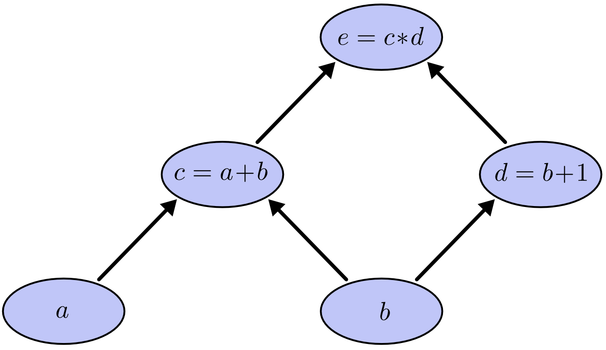

## Backpropagation

Reference: [colah's blog](http://colah.github.io/posts/2015-08-Backprop/)  

The general, application independent, name of backpropagation is “reverse-mode differentiation.”
Fundamentally, it’s just a technique for calculating derivatives quickly.

#### Computational Graphs
Computational graphs are a nice way to think about mathematical expressions. For example, consider the expression $e=(a+b)∗(b+1)$

We can evaluate the expression by setting the input variables to certain values and computing nodes up through the graph.

#### Derivatives on Computational Graphs
If one wants to understand derivatives in a computational graph, the key is to understand derivatives on the edges. If $a$ directly affects $c$, then we want to know how it affects $c$. If $a$ changes a little bit, how does $c$ change? We call this the partial derivative of $c$ with respect to $a$.

**What if we want to understand how nodes that aren’t directly connected affect each other?** 
The general rule is to sum over all possible paths from one node to the other, multiplying the derivatives on each edge of the path together. For example, to get the derivative of e with respect to b we get:
$$\frac{\partial e}{\partial b}= 1*2 + 1*3$$

_This general “sum over paths” rule is just a different way of thinking about the multivariate chain rule._

#### Factoring Paths
The problem with just “summing over the paths” is that it’s very easy to get a combinatorial explosion in the number of possible paths.

$\frac{\partial Z}{\partial X} = \alpha\delta + \alpha\epsilon + \alpha\zeta + \beta\delta + \beta\epsilon + \beta\zeta + \gamma\delta + \gamma\epsilon + \gamma\zeta$

The above only has nine paths, but it would be easy to have the number of paths to grow exponentially as the graph becomes more complicated.

Instead of just naively summing over the paths, it would be much better to factor them:
$\frac{\partial Z}{\partial X} = (\alpha + \beta + \gamma)(\delta + \epsilon + \zeta)$

This is where “forward-mode differentiation” and “reverse-mode differentiation” come in.They’re algorithms for efficiently computing the sum by factoring the paths. Instead of summing over all of the paths explicitly, they compute the same sum more efficiently by merging paths back together at every node. **In fact, both algorithms touch each edge exactly once!**

[Next refer this article](https://mattmazur.com/2015/03/17/a-step-by-step-backpropagation-example/)
