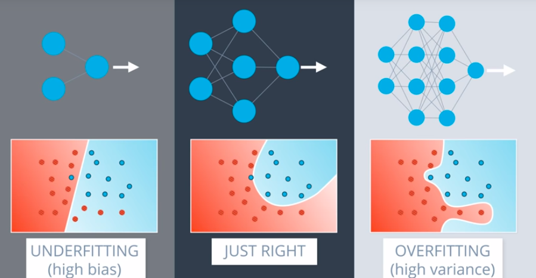
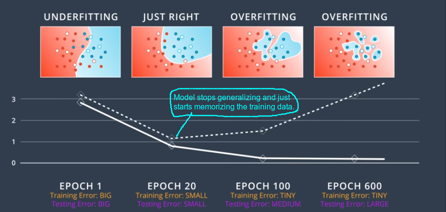
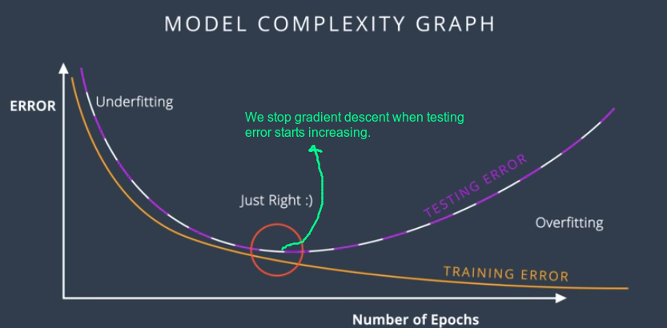

### Problems during training of neural networks

##### Overfitting
Divide our original data set  into training and test set.

Overfitting-- Our model is way too complicated.

Underfitting -- Our model is way too simple.

As we shall see often it's very hard to get the right model and we'll almost always end up on the left or right model.

So we'll try err on the side of overly complicated models and then we'll apply certain techniques to prevent Overfitting.

 * Early Stopping: 

 * Regularization: [L1 and L2 Regularization](https://www.youtube.com/watch?v=ndYnUrx8xvs)

 * Dropout Regularization:

##### [Local Minima Problem](https://www.youtube.com/watch?time_continue=42&v=gF_sW_nY-xw)
 * One way to solve this probelm is many random restarts. This will increase the probability of getting to the global minimum.

 * Use Momentum

##### [Vanishing Gradient](https://www.youtube.com/watch?time_continue=64&v=W_JJm_5syFw)
To solve this change the activation function from sigmoid to hyperbolic tangent or Rectified Linear Unit.

***Batch vs Stochastic Gradient Descent*** 

[*Learning Rate Decay*](https://www.youtube.com/watch?time_continue=43&v=TwJ8aSZoh2U)
