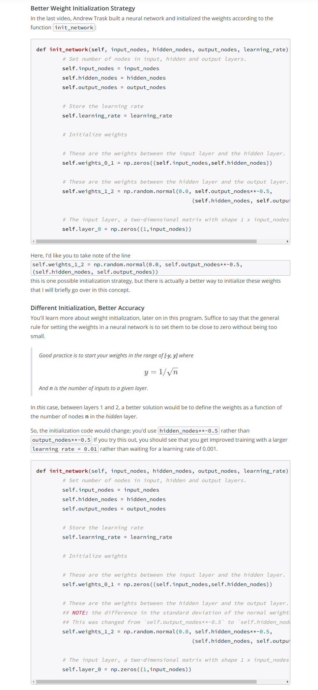
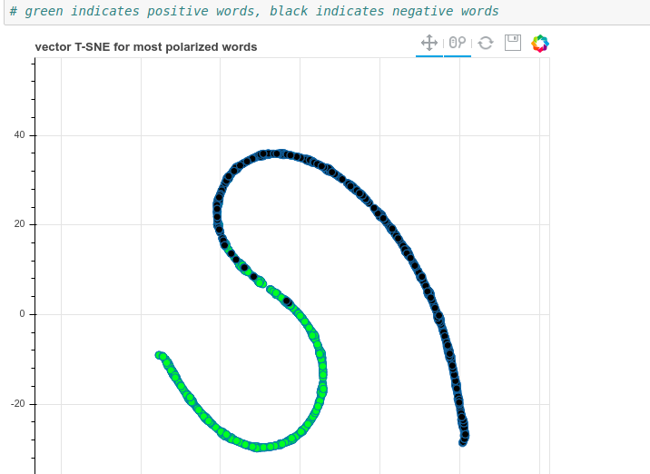

## Sentiment Analysis with Andrew Trask

 * Natural language processing is the study of human language using tools Machine learning, in our case, Deep learning.

 * In this tutorial we'll learn about sentiment classification or the classification of whether or not a section of human generated text is positive or negative.

  * **We'll see how to frame a problem, because neural nets don't naturally accepts texts input, they accept numbers** so that the network can be successful in discovering correlation between your input and your output data. So we're going to transform our textual input data into numerical form.

 * [Datasets and our predictive theory](https://www.youtube.com/watch?v=IsTOnkAKaJw)

 * Follow Sentiment_Classification_Projects.ipynb

 * **Weight Initialization Strategy**

### Understanding neural noise --(Project - 4)
 * In this section we're going to learn about noise versus signal. We have a ton of data, we know there's a pattern and we want the neural
 network to be able to find it.

 * The activation of a node affects how dominantly the weights control the next layer and in the same way the weights control how dominantly the activation affects the next layer. So they're multiplied by each other and it's an associative thing.

 * [We see that non-sentimental words such as 'I', 'all', 'is', '.' dominate the review. And these words then have a dominant effect in the hidden layer, which the output layer relies on to try to make a prediction. So if the hidden layer
 doesn't have rich information about sentiments, the output layer is going to struggle.](https://www.youtube.com/watch?v=ubqhh4Iv7O4)

 * Maybe count of words was a bad idea, because the counts doesn't highlight the signal (correlation). When we look at the count of words it seems like the noise(words such as 'I', 'all', 'is', '.') is being highlighted(weighted most heavily). Neural nets are just weights and functions and if our weighting is off, or how we create our input data, it's going to make it really hard to find the signal. The way we're framing the problem is
 adding a significant amount of noise.

 * We need sentimental words such as 'insightful', 'welcome', etc. to be listened more attentively and therefore we don't weigh words by their counts anymore, rather as a one or a zero.

 * We'll not only see amazing improvement becuase of the elimination of most of our noise by getting rid of the counts but the neural net will also be able to find correlation much faster now.

 * This is what increasing a signal and reducing the noise is all about, making it more obvious for our neural net to get to work at handling the signal for more difficult patterns.

### Understanding Inefficiencies in our Network --(Project - 5)
In terms of accuracy of our neural network, we saw a lot of progress. However, the actual computational speed, i.e. the number of seconds that it takes to do a full pass is still pretty slow. So what we're going to do now is to analyze what's going on in our network and look for things that we can shave out that are going to allow
our neural net to go faster.
[Two found inefficiencies elimination](https://www.youtube.com/watch?v=4MuS-6ATxCU)

### [Idea - Further Reducing Noise](https://www.youtube.com/watch?time_continue=233&v=Kl3hWxizKVg)
[Implementation - We have a ton on words in our corpus that don't have predictive power. So let's rid of those words.](https://www.youtube.com/watch?v=ji0famK7gOQ)

### Analysis: What's Going on in the Weights?
In this section we'll try to understand what are the weights doing when neural network gets trained?

Words like horrible, terrible are associated with negativity while words like excellent, fantastic, are trying to predict the output as one. So what's interesting is that if these words are being trained, which they're trained to manipulate the output in the same way, to create a high value or a low value.

**And as we update the weights using gradient descent weights of input units having same sentiments, from input to hidden layer become similar, why? Because both of them have the same goal.**

We actually checked this using the function get_most_similar_words() in the code provided. The network has figured out what words are related, or what words are trying to create the same effect on the output unit. All these related words don't have same meaning but the same context or sentiment.

The neural net has clearly separated the big long black negative cluster, from the green positive cluster.

This is what neural networks is all about. Framing the problem, understanding what's going on under the hood so that we can reduce the noise as much as possible, increase the signal as much as possible so that neural net can find the structure that we're interested in it finding.
