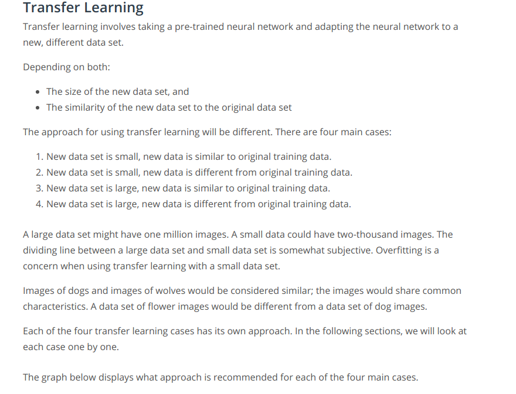
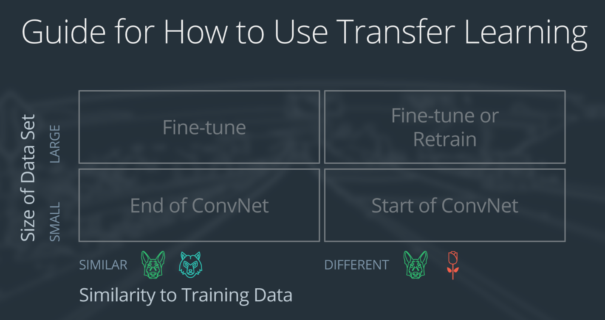
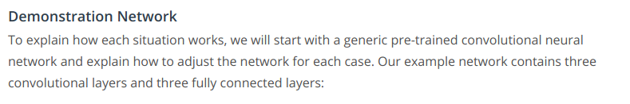
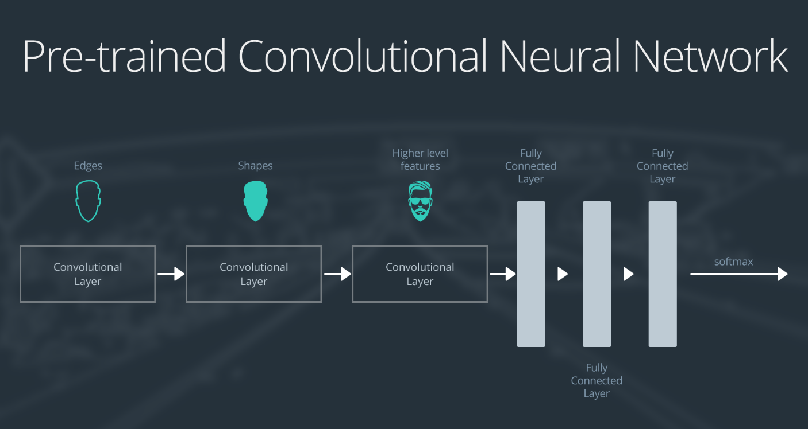
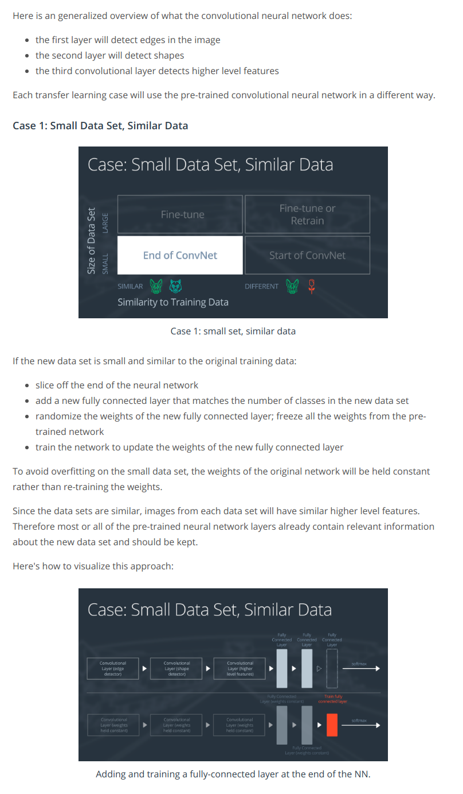
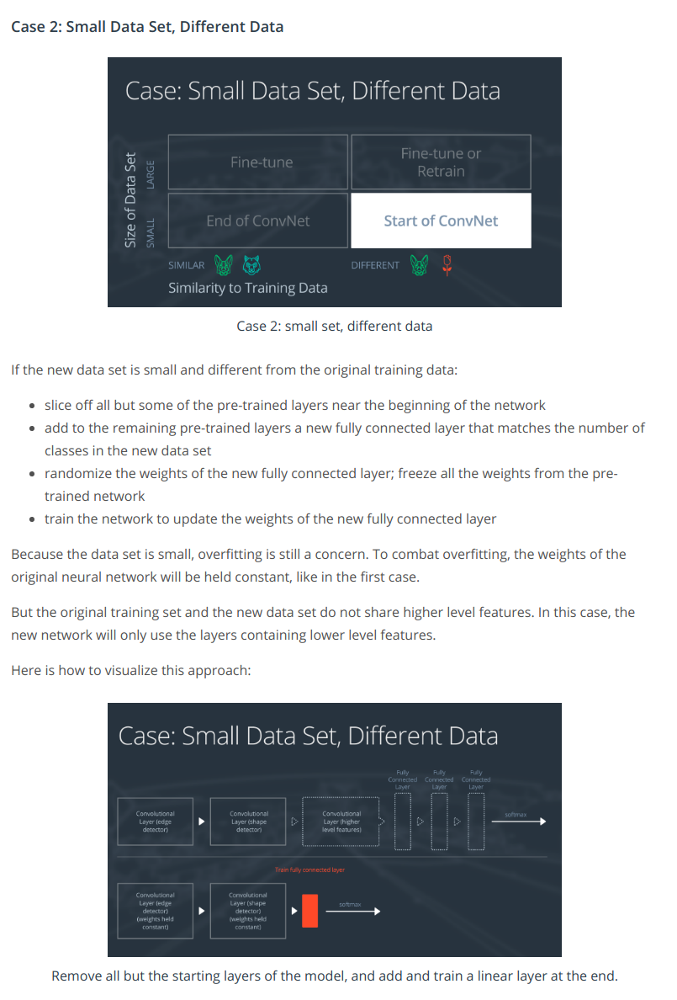
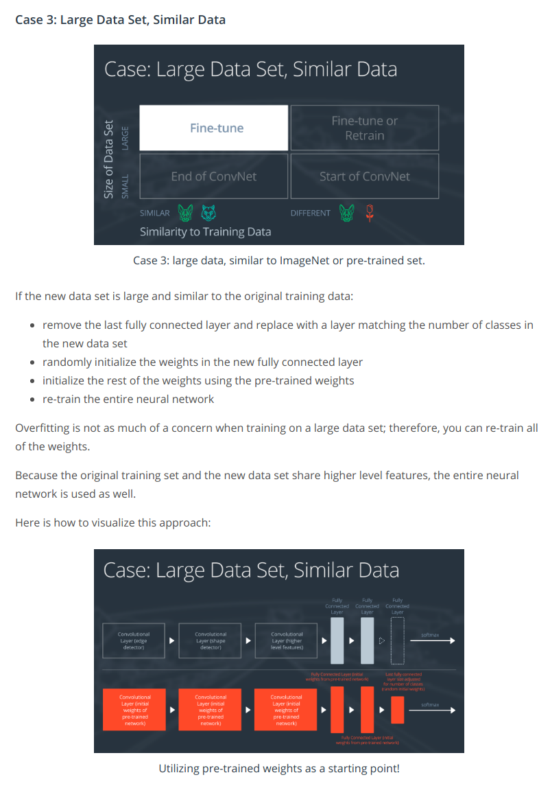
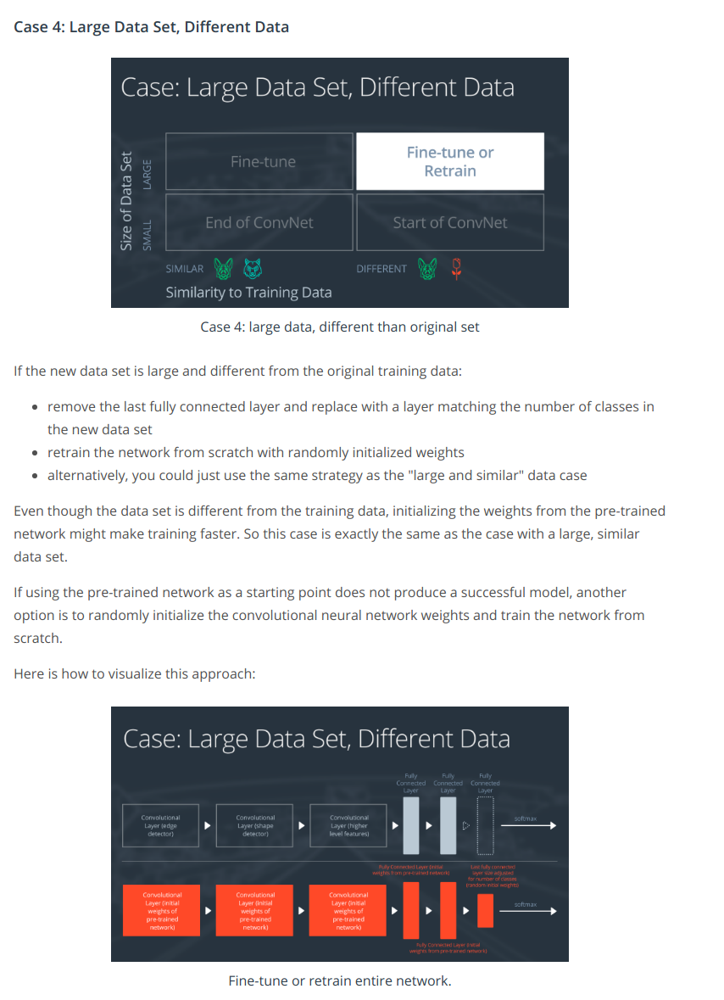

We already know some state of the art CNN architectures like VGG and ResNet which are the results of careful experimentation with many architectures and extensive hyperparameter tuning. They've been trained on the very large ImageNet database, which has 1,000 object classes.
and this often takes weeks even on multiple GPUs. So, it would be ideal if we could find a way to use what these models have already learned, and apply that knowledge to a new task, i.e. 
Instead of constructing a CNN from scratch, we take the knowledge from a trained CNN like ResNet, and use it to help classify the set of images through a technique called transfer learning. Transfer learning is all about how to use a pre-trained network and apply it to a task of your own design, transferring what it's learned from one task to another. 
But the important question is: **How transferable can certain knowledge be?**
* [Useful Layers](https://www.youtube.com/watch?v=kn4BN7z3UGQ)

* Transfer Learning       

* Refer:   Transfer_Learning_Exercise.ipynb
