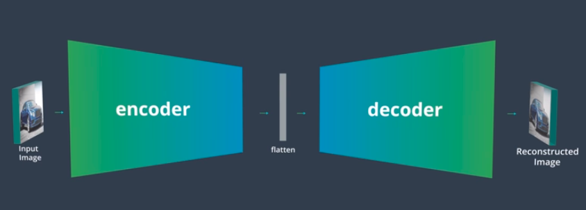

* We have already seen how CNNs take an input image, and through a series of layers, transform that input into an output that's much smaller in the x and y dimensions, but much greater in depth. We can also think of this structure as a kind of data compression, compressing from an image into a feature vector, a feature map produced after an input has gone through a series of layers squished into a vector shape. This is part of what makes up an autoencoder.

* An autoencoder has two main components: an encoder that compresses some input data, and a decoder that reconstructs data from the compressed representation.  Autoencoders are used in a traditional data compression sense, in that they can learn to reduce the dimensionality of any input and then anyone can use a compressed representation to share it, view it and so on, faster than they could with the original input.

* We might think of something like a jpeg or mp3 file type, which contain explicit rules for compressing images and audio. But an autoencoder learn these efficient data compression and decompression functions instead of having them designed, encoded by a human. Autoencoders have shown the most promise in image de-noising techniques and in filling in missing data.  
Now we'll see how to build an autoencoder using PyTorch.

* Refer: Simple_Autoencoder.ipynb for autoencoder formed by linear layers

* [Autoencoders using CNN](https://www.youtube.com/watch?v=KjztLwPksj8)    [Math behind Transpose convolutional layers](https://www.youtube.com/watch?v=hnnLAC1Q0zg)   Refer: Convolutional_Autoencoder.ipynb

* [Upsampling](https://www.youtube.com/watch?v=XX63da4EPN0)

* In practice autoencoders do not excel at compressing images but they can learn pretty well how to denoise them given a noisy and non-noisy set to learn from. The idea is this given an input set of noisy data and a target set of data that's the non noisy image data, the encoder can learn to distill important information from the noisy image and the decoder can learn to produce a non noisy reconstruction. This **Denoising application is really pretty interesting, because the Autoencoder is having to learn something about the content of quite a noisy image and then it learns how to transform it into a non noisy version.**

* Refer: Denoising_Autoencoder.ipynb
