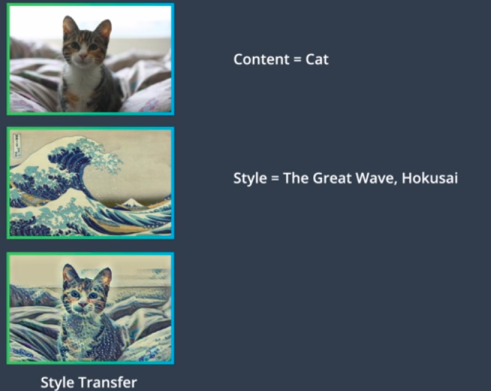
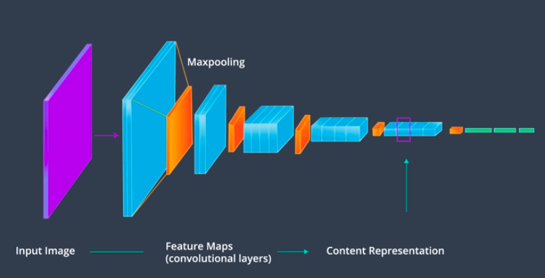

**CNN's are some ofthe most powerful networks for image classification and analysis. CNN's process visual information in a feed forward manner, passing an input image through a collection of image filters which extract certain features from the input image. It turns out that these feature level representations are not only useful for classification, but for image construction as well.**

 * Feature level representations are the basis for applications like Style Transfer and Deep Dream. In this tutorial we'll focus on learning about and implementing the style transfer algorithm.

 * Style transfer allows us to apply the style of one image to another image of our choice. For example  The key to this technique is using a trained CNN to separate the content from the style of an image and merge the content of this image with the style of another and create something entirely different.

 * When a CNN is trained to classify images, it's convolutional layers learn to extract more and more complex features from a given image. Intermittently, max pooling layers will discard detailed spatial information, information that's increasingly irrelevant to the task of classification. The effect of this is that as we go deeper into a CNN, the input image is transformed into feature maps that increasingly care about the content of the image rather than any detail about the texture and color of pixels. Later layers of a network are even sometimes referred to as a content representation of an image.  In this way, a trained CNN has already learned to represent the content of an image, but how do we isolate only the style of an image?

 * Style can be thought of as traits that might be found in the brush strokes of a painting, its texture, colors, curvature, and so on. To represent the style of an input image, a feature space designed to capture texture and color information is used. This space essentially looks at spatial correlations within a layer of a network. A correlation is a measure of the relationship between two or more variables. For example, you could look at the features extracted in the first convolutional layer which has some depth corresponding to the number of feature maps in that layer. For each feature map, we can measure how strongly its detected features relate to the other feature maps in that layer. Is a certain color detected in one map similar to a color in another map? or What about the differences between detected edges and corners, and so on?  If there are common colors and shapes among the feature maps, then this can be thought of as part of that image's style. So, the similarities and differences between features in a layer should give us some information about the texture and color information found in an image.

 * Now let's take a complete style transfer example. Style transfer will look at two different images. often called the style image and the content image. Using a trained CNN, style transfer finds the style of one image and the content of the other. Finally, it tries to merge the two to create a new third image such that the objects and their arrangement are taken from the content image, and the colors and textures are taken from the style image. In our cat example above, style transfer creates a new image that keeps the cat content, but renders it with the colors, the print texture, the style of the wave artwork.

 * [VGG19 and Content loss](https://www.youtube.com/watch?v=PQ1UuzOIjCM)  [Image Style Transfer Using Convolutional Neural Networks](https://www.cv-foundation.org/openaccess/content_cvpr_2016/papers/Gatys_Image_Style_Transfer_CVPR_2016_paper.pdf)  [Gram Matrix](https://www.youtube.com/watch?v=e718uVAW3KU) [Style Loss](https://www.youtube.com/watch?v=VazrQ7u-OHo) [Loss weights](https://www.youtube.com/watch?v=qO8oiZBtG1I)
