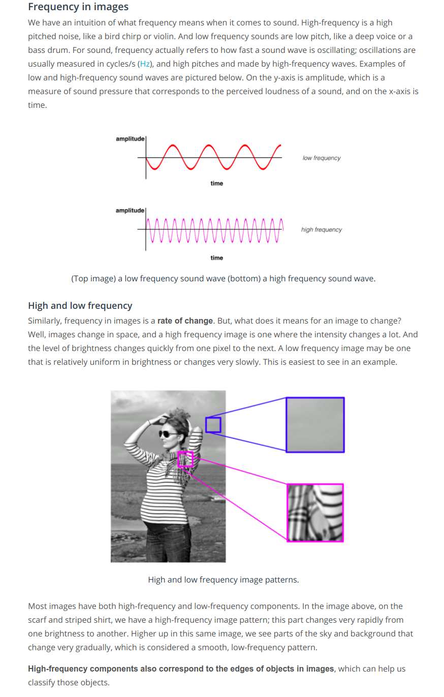
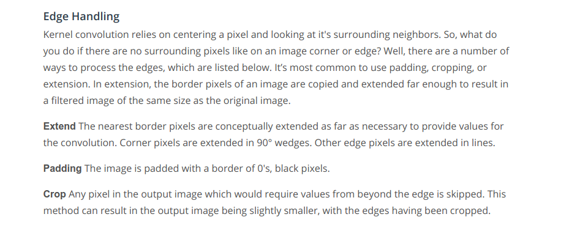
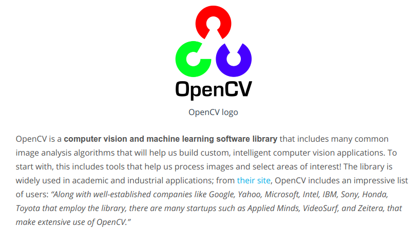
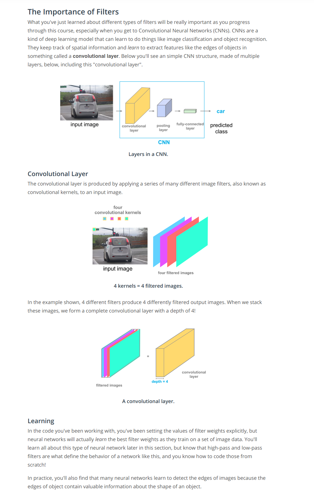
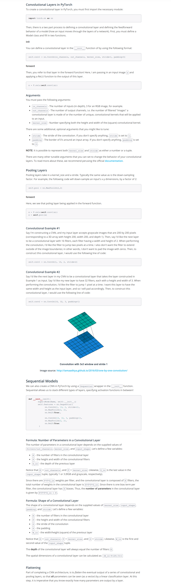

 * The MNIST database is very clean and pre-processed. All images of digits are roughly the same size and are centered in a 28 by 28 pixel grid. Now if we have to classify the digit which could appear anywhere within the grid, and sometimes appear quite small or quite large then it would be a very challenging task for an MLP. Also, in the case of real-world messy image data, CNNs and MLPs do not even compare, CNNs truly shine.

* Two important issues while performing image classification with MLPs:
    - MLPs use a lot of parameters -- The MLP for very small 28 by 28 images, already contained over half a million parameters.
    - Information from the patterns in image -- We threw away all of the 2-D information contained in an image when we flattened its matrix to a vector. This spatial information(knowledge of where the pixels are located in reference to each other) is relevant to understanding the image patterns contained in the pixel values.
    - CNNs address the above two problems by using layers that are more sparsely connected and also the connections between layers are informed by the 2-D structure of the image matrix. Furthermore, CNNs will accept our matrix as input.
    - The key to preserving the spatial information is something called the convolutional layer. A convolutional layer applies a series of different image filters also known as convolutional kernels to an input image. The resulting filtered images have different appearances. The filters may have extracted features like the edges of objects in that image, or the colors that distinguish the different classes of images. In the case of classifying digits for example, CNN should learn to identify spatial patterns like the curves and lines that make up the number as distinct from another numbers.
    - [Contrast](https://www.youtube.com/watch?v=hfqNqcEU6uI) -- To detect changes in intensity in an image, we’ll be using and creating specific image filters that look at groups of pixels and react to alternating patterns of dark/light pixels. These filters produce an output that shows edges of objects and differing textures.

 * Frequency w.r.t images 

 * #### [High-pass filters](https://www.youtube.com/watch?v=OpcFn_H2V-Q)  
 Refer: Finding Edges and Custom Kernels.ipynb

 * The importance of filters  [Convolutional Layers](https://www.youtube.com/watch?v=RnM1D-XI--8)

 * We'll now see one final type of layer called pooling layer before building our CNN. A convolutional layer is a stack of feature maps where we have one feature map for each filter. Using a large number of filters, each responsible for finding a pattern in the image, builds a bigger stack which results in the dimensionality of convolutional layers being very large. Higher dimensionality implies more parameters, which can lead to over-fitting. Pooling layers are a method of reducing this dimensionality within a convolutional neural network. There are various types of pooling layers such as maxpooling, average pooling. Average pooling is not used for image classification problems because maxpooling is better at noticing the most important details about edges and other features in an image, but we may use this in applications for which smoothing an image is preferable.

 * Refer: conv_visualization.ipynb & maxpooling_visualization.ipynb

 * There's still one complication, if we go online and collect thousands or millions of images, it's pretty much guaranteed that they'll all be different sizes. Similar to MLPs, the CNNs will require a fixed size input. So we've another pre-processing step, alongside normalization and conversion to a tensor datatype.  It's very common to resize each image to be a square, with the spatial dimensions equal to a power of two, or else a number that's divisible by a large power of two.

 * #### Padding:
 Padding is just adding a border of pixels around an image. When we create a convolutional layer, we move a square filter around an image, using a center-pixel as an anchor. So, this kernel cannot perfectly overlay the edges/corners of images. The nice feature of padding is that it will allow us to control the spatial size of the output volumes (most commonly as we’ll see soon we will use it to exactly preserve the spatial size of the input volume so the input and output width and height are the same).

 *  [Read more about Conv2d in the documentation](https://pytorch.org/docs/stable/nn.html#conv2d)

 * [CNNs convert Images to Feature vectors](https://www.youtube.com/watch?v=g6QuiVno8zI)

 * Refer: cifar10_cnn.ipynb

 * [Check out the CIFAR-10 Competition's winning architecture!](http://blog.kaggle.com/2015/01/02/cifar-10-competition-winners-interviews-with-dr-ben-graham-phil-culliton-zygmunt-zajac/)
