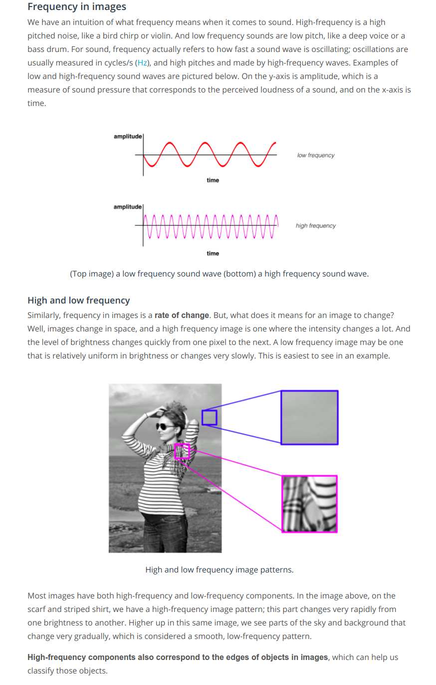

 * The MNIST database is very clean and pre-processed. All images of digits are roughly the same size and are centered in a 28 by 28 pixel grid. Now if we have to classify the digit which could appear anywhere within the grid, and sometimes appear quite small or quite large then it would be a very challenging task for an MLP. Also, in the case of real-world messy image data, CNNs and MLPs do not even compare, CNNs truly shine.

* Two important issues while performing image classification with MLPs:
    - MLPs use a lot of parameters -- The MLP for very small 28 by 28 images, already contained over half a million parameters.
    - Information from the patterns in image -- We threw away all of the 2-D information contained in an image when we flattened its matrix to a vector. This spatial information(knowledge of where the pixels are located in reference to each other) is relevant to understanding the image patterns contained in the pixel values.
    - CNNs address the above two problems by using layers that are more sparsely connected and also the connections between layers are informed by the 2-D structure of the image matrix. Furthermore, CNNs will accept our matrix as input.
    - The key to preserving the spatial information is something called the convolutional layer. A convolutional layer applies a series of different image filters also known as convolutional kernels to an input image. The resulting filtered images have different appearances. The filters may have extracted features like the edges of objects in that image, or the colors that distinguish the different classes of images. In the case of classifying digits for example, CNN should learn to identify spatial patterns like the curves and lines that make up the number as distinct from another numbers.
    - [Contrast](https://www.youtube.com/watch?v=hfqNqcEU6uI) -- To detect changes in intensity in an image, we’ll be using and creating specific image filters that look at groups of pixels and react to alternating patterns of dark/light pixels. These filters produce an output that shows edges of objects and differing textures.

 * Frequency w.r.t images
