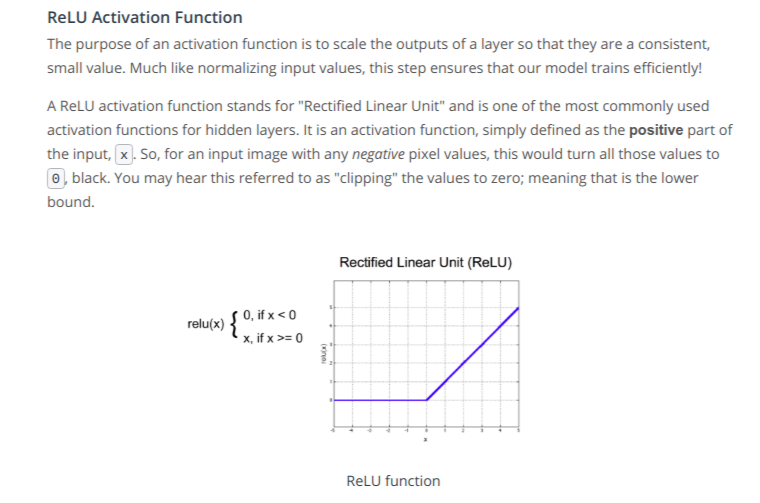
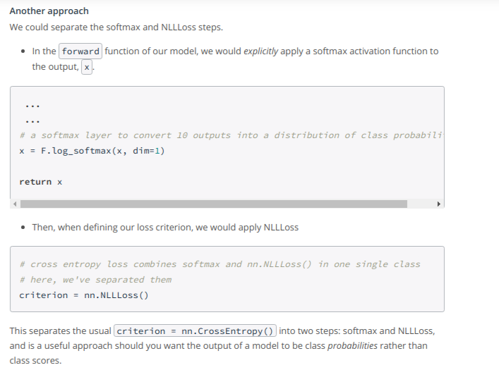
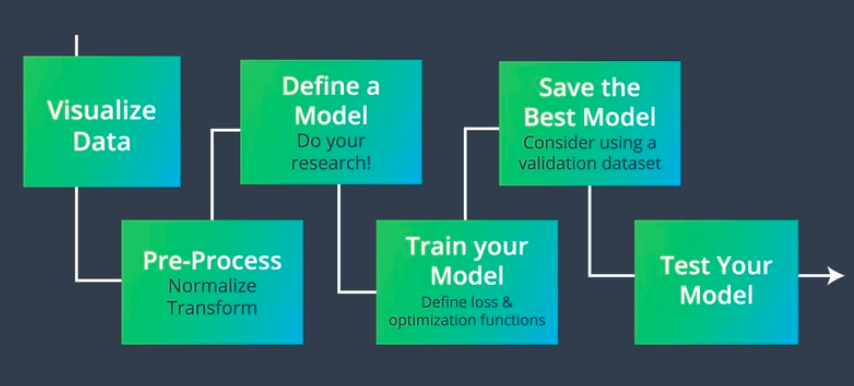

### Convolutional Neural Networks
* CNNs achieve state of the art results in a variety of problem areas such as Voice User Interfaces, Natural Language Processing, and computer vision. In the field of Voice User Interfaces, [Google made use of CNNs in its WaveNet model](https://deepmind.com/blog/wavenet-generative-model-raw-audio/) which takes any piece of text as input and does an excellent job of returning computer-generated audio of a human reading the text.
What's really cool is that if you supply the algorithm with enough samples of your voice, it's possible to train it to sound just like you.  As for the field of Natural Language Processing, Recurrent Neural Networks are used more frequently than Convolutional Neural Networks. [Facebook's novel CNN approach](https://code.fb.com/ml-applications/a-novel-approach-to-neural-machine-translation/) for language translation that achieves state-of-the-art accuracy at nine times the speed of RNN models.

* CNNs can look at images as a whole and learn to identify spatial patterns such as prominent colors and shapes, or whether a texture is fuzzy or smooth and so on. Example, say we see a person walking toward us and we want to see if it’s someone we know; we may look at their face, and even further their general shape, eyes (and even color of their eyes). The distinct shape of a person and their eye color a great examples of distinguishing features. The shapes and colors that define any image and any object in an image are often called features. Further we’ll see that features like these can be measured, and represented as numerical data, by a machine. 

We'll use MNIST database, the most famous database in the field of deep learning, to build a classifier that classifies handwritten digits. It was one of the first databases used to prove the usefulness of neural networks and continued to inform the develoment of new architectures overtime.

* [How computer interpret images.](https://www.youtube.com/watch?v=mEPfoM68Fx4) Data normalization is an important pre-processing step. It ensures that each input (each pixel value) comes from a standard distribution. That is, the range of pixel values in one input image are the same as the range in another image. This standardization makes our model train and reach a minimum error, faster! Data normalization is typically done by subtracting the mean (the average of all pixel values) from each pixel, and then dividing the result by the standard deviation of all the pixel values. The distribution of such data should resemble a Gaussian function centered at zero. For image inputs we need the pixel numbers to be positive, so we often choose to scale the data in a normalized range [0,1] by dividing each pixel value by 255.

* In our image classification probelm output values after softmax layer are often called class scores which indicate how sure the network is that a given input is of a specific class.

* Training of a neural network is done using some process which involves Loss and Optimization. (Calculating loss)Measure the mistakes between a predicted and true class using some loss function(Cross Entropy loss is often used for categorical data), (Backpropagation)Compute the gradient of the loss w.r.t. model weights, quantifying how bad a particular weight is in making a mistake, (Optimization)Apply gradient descent to calculate better weight values.

* [Defining a network in PyTorch](https://www.youtube.com/watch?v=9gvaQvyfLfY)  [Training the network](https://www.youtube.com/watch?v=904bfqibcCw)

* **Cross-Entropy Loss** --
In the [PyTorch documentation](https://pytorch.org/docs/stable/nn.html#crossentropyloss), we can see that the cross entropy loss function actually involves two steps:
  * It first applies a softmax function to any output is sees.
  * Then applies [NLLLoss](https://pytorch.org/docs/stable/nn.html#nllloss); negative log likelihood loss

Then it returns the average loss over a batch of data. Since it applies a softmax function, we do not have to specify that in the forward function of our model definition, but we could do this another way. 

* Refer *mnist_mlp_exercise.ipynb* for **MLP Classification, MNIST** [Activation Functions](http://cs231n.github.io/neural-networks-1/#actfun)

* The exact number of epochs to be used for training is hard to determine. So in practice we break the dataset into three sets called training, validation and test sets. The model looks only at the training set when it's actively training and deciding how to modify its weights. After every training epoch, we check the training loss and the loss on the validation set. The model does not use any part of the validation set for the back propagation step, to get an idea of how well the model generalizes to a set of data that is separate from the training set and not overfitting the training set of data.  Now the question that arises is: **Why must we create a third dataset called test set?**  The idea is that when we test the model, it looks at data that it has truly never seen before. Even though the model doesn't use the validation set to update its weights, our model selection process is based on how the model performs on both the training and validation sets. In the end, we get the model that is somehow biased in favor of the validation set.

* Refer *mnist_mlp_solution_with_validation.ipynb* for validation set implementation

* Story so Far:  Next we'll look on CNN's for image classification task.
