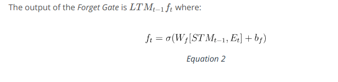
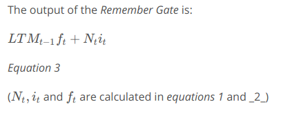
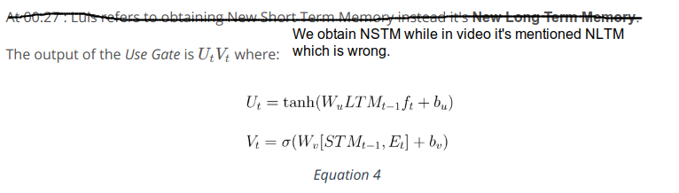

Long Short Term Memory Networks are quite useful when our neural network needs to switch between remembering recent things, and things from long time ago. Training a RNN using back propagation will lead to problems such as the vanishing gradient problem which basically means with recurring neural networks the memory that is stored is normally short term memory. RNNs, have a hard time storing long term memory and this is where LSTMs or long short term memory networks will come to the rescue. 
 * [Basics of LSTM](https://www.youtube.com/watch?v=gjb68a4XsqE)
 * [Architecture of LSTM](https://www.youtube.com/watch?v=ycwthhdx8ws)
 * [The Learn Gate](https://www.youtube.com/watch?v=aVHVI7ovbHY) 
 * [The Forget Gate](https://www.youtube.com/watch?v=iWxpfxLUPSU) 
 * [The Remember Gate](https://www.youtube.com/watch?v=0qlm86HaXuU) 
 * [The Use Gate](https://www.youtube.com/watch?v=5Ifolm1jTdY) 
 * [Putting it all together](https://www.youtube.com/watch?v=IF8FlKW-Zo0)
 * [Other Architectures](https://www.youtube.com/watch?v=MsxFDuYlTuQ)

Excellent Sources on LSTM:
 * [Chris Olah's LSTM post](http://colah.github.io/posts/2015-08-Understanding-LSTMs/)
 * [Edwin Chen's LSTM post](http://blog.echen.me/2017/05/30/exploring-lstms/)
 * [Andrej Karpathy's lecture on RNNs and LSTMs from CS231n](https://www.youtube.com/watch?v=iX5V1WpxxkY)
