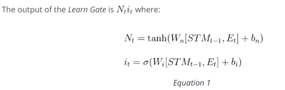
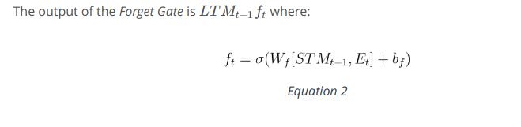
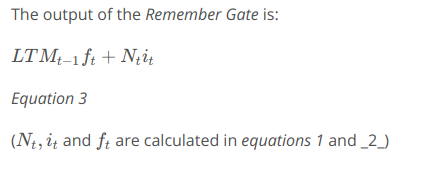
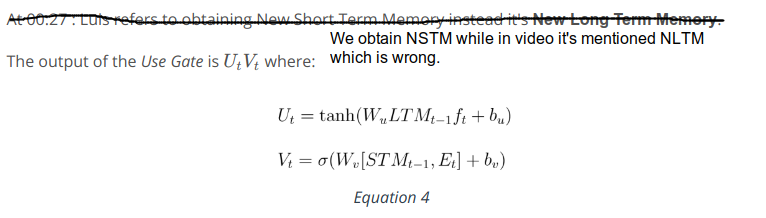
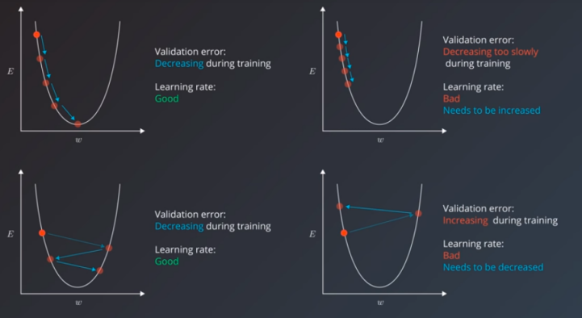

Long Short Term Memory Networks are quite useful when our neural network needs to switch between remembering recent things, and things from long time ago. Training a RNN using back propagation will lead to problems such as the vanishing gradient problem which basically means with recurring neural networks the memory that is stored is normally short term memory. RNNs, have a hard time storing long term memory and this is where LSTMs or long short term memory networks will come to the rescue. 
 * [Basics of LSTM](https://www.youtube.com/watch?v=gjb68a4XsqE)
 * [Architecture of LSTM](https://www.youtube.com/watch?v=ycwthhdx8ws)
 * [The Learn Gate](https://www.youtube.com/watch?v=aVHVI7ovbHY) 
 * [The Forget Gate](https://www.youtube.com/watch?v=iWxpfxLUPSU) 
 * [The Remember Gate](https://www.youtube.com/watch?v=0qlm86HaXuU) 
 * [The Use Gate](https://www.youtube.com/watch?v=5Ifolm1jTdY) 
 * [Putting it all together](https://www.youtube.com/watch?v=IF8FlKW-Zo0)
 * [Other Architectures](https://www.youtube.com/watch?v=MsxFDuYlTuQ)

Excellent Sources on LSTM:
 * [Chris Olah's LSTM post](http://colah.github.io/posts/2015-08-Understanding-LSTMs/)
 * [Edwin Chen's LSTM post](http://blog.echen.me/2017/05/30/exploring-lstms/)
 * [Andrej Karpathy's lecture on RNNs and LSTMs from CS231n](https://www.youtube.com/watch?v=iX5V1WpxxkY)

#### Implementing RNNs
The challenges in designing and implementing any kind of RNN are two-fold. First, how can we pre-process sequential data, such as a series of sentences, and convert it into numerical data that can be understood by a neural network? Second, how can we represent memory in code? We'll look at an example to give an idea of how PyTorch represents RNNs and how to represent memory in code. Refer: time-series/[Simple_RNN.ipynb](https://www.youtube.com/watch?v=xV5jHLFfJbQ) 
[Training RNN](https://www.youtube.com/watch?v=sx7T_KP5v9I)
 * [Character-wise RNNs](https://www.youtube.com/watch?v=dXl3eWCGLdU) [Sequence Batching](https://www.youtube.com/watch?v=Z4OiyU0Cldg)
 * Refer: char-rnn/[Character_Level_RNN.ipynb](https://www.youtube.com/watch?v=ed33qePHrJM)

#### Hyperparameters
A hyper parameter is a variable that we need to set before applying a learning algorithm into a dataset. The challenge with hyper parameters is that there are no magic numbers that work everywhere. The best numbers depend on each task and each dataset. Generally speaking, we can break hyper parameters down into two categories. The first category is optimizer hyperparameters. These are the variables related more to the optimization and training process than to the model itself. These include the learning rate, the minibatch size, and the number of training iterations or epochs. The second category is model hyperparameters. These are the variables that are more involved in the structure of the model. These include the number of layers and hidden units and model specific hyper parameters for architectures like RNMs.
 * Learning Rate:
     - > "The single most important hyperparameter and one should always make sure that it has been tuned" - Yoshua Bengio
     - Below is a simple example with only one parameter, and an ideal convex error curve.  Things are much more complicated in the real world.
     - Learning rate decay is the technique of decreasing the learning rate during the course of training so that the algorithm could converge to the minimum and not stuck oscillating between values that still have a better error value than when we started training, but are not the best values possible for the model.
     - In addition to simply decreasing the learning rate, there are more clever learning algorithms that have an adaptive learning rate meaning not only decreasing the learning rate when needed, but also increasing it when it appears to be too low. Adam optimizer and Adagrad optimizer are some of the adaptive learning optimizers.

  * Minibatch size:
      - Minibatch size has an effect not only on the resource requirements of the training process but also impacts training speed and number of iterations.
      - Historically there had been debate between stochastic graident descent and batch gradient descent.
      - Large minibatch size allows computational boosts that utilizes matrix multiplication, in the training calculations. But that comes at the expense of needing more memory for the training
      process, and generally, more computational resources. Some out of memory errors can be eliminated by decreasing the minibatch size.
      - Small minibatch size has more noise in their error calculations, and surprisingly this noise is often helpful in preventing the training process from stopping at local minima on the error curve rather than the global minima that creates the best model.
 * Number of Epochs:
      - The intuitive manual way is to have the model train for as many epochs, the validation error keeps is decreasing.
      - The number of training iterations is a hyperparameter we can optimize automatically using a technique called early stopping (also "early termination").
* Number of hidden units and layers:
    - The number and architecture of the hidden units is the main measure for a model's learning capacity. If we provide the model with too much capacity it might tend to overfit and just try to memorize the training set.
    - A little larger than the ideal number is not a problem, but a much larger value can often lead to the model overfitting. So if your model is not training, add more hidden units and track validation error. Keep adding hidden units
    until the validation error starts getting worse.
    -  > "In practice it is often the case that 3-layer neural networks will outperform 2-layer nets, but going even deeper (4,5,6-layer) rarely helps much more. This is in stark contrast to Convolutional Networks, where depth has been found to be an extremely important component for a good recognition system (e.g. on order of 10 learnable layers)." -- Andrej Karpathy 
