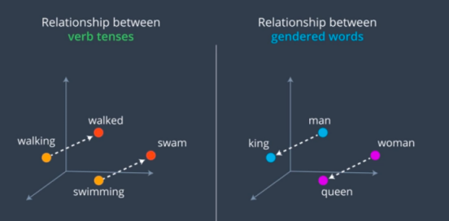
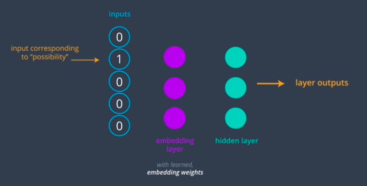

Word embedding is the collective term for models that learn to map a set of words or phrases in a vocabulary to vectors of numerical values. These vectors are called embeddings and can be learnt using neural networks. **Word embeddings is not only used to reduce the dimensionality of text data but these embedding models can also learn some interesting traits about words in a vocabulary**. In fact, we'll focus on the Word2Vec embedding model which learns to map words to embeddings that contain semantic meaning.           
In the above image embeddings learn the relationship between verbs in the present and past tense. The relationship between the embeddings for walking and walked, should be the same as the relationship between the embeddings for swimming and swam. Similarly embeddings can learn the relationships between words and common genders. Such as between woman and Queen and between man and King.  **We can think of the above embeddings as vectors that have learned to mathematically represent the relationship between words in a vocabulary**.
##### Word of Caution:
> The embeddings are learned from a body of text, so any word associations in that source text will be replicated in the embeddings. If your text contains false information or gender biased associations these traits will be replicated in your embeddings. Debiasing word embeddings is an active area of research.

 * Word embedding is all about improving the ability of networks to learn from texted data by representing that data as lower-dimensional vectors. Till now when dealing with text, we split things up into words and get tens of thousands of different words in a large data set called vocabulary. When using these words as input to a network like an R&N, we one-hot encode them. Then we pass this long vectors as input to some hidden layer in the network and get huge matrix of values most of which are zero, because of the initial one-hot vector. This is really computationally inefficient. To solve this problem, we use embeddings.

 * To learn word embeddings, we use a fully-connected linear layer called as the embedding layer, and its weights that are learned during training this embedding model are called the embedding weights.  Take an example: say we have the word *heart* encoded as the integer 958 in vocabulary. Then, to get the hidden layer values for *heart*, we just take the 958th row of the embedding weight matrix. This process is called an embedding lookup. The number of hidden units is the embedding dimension, the embedding lookup table is just a weight matrix, and the embedding layer is just a hidden layer.

 * For further information Refer: word2vec-embeddings/Skip_Grams.ipynb
 * [Word2Vec Model](https://www.youtube.com/watch?v=7BEYWhym8lI)
 * [Negative Sampling](https://www.youtube.com/watch?v=gnCwdegYNsQ)
 * Refer: Negative_Sampling.ipynb
 * [SkipGramNeg Model](https://www.youtube.com/watch?v=7SqNN_eUAdc)
