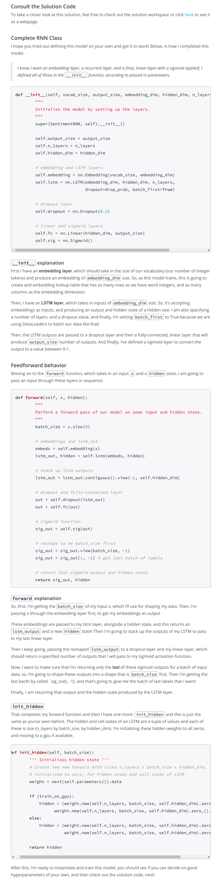
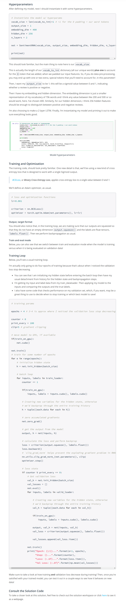
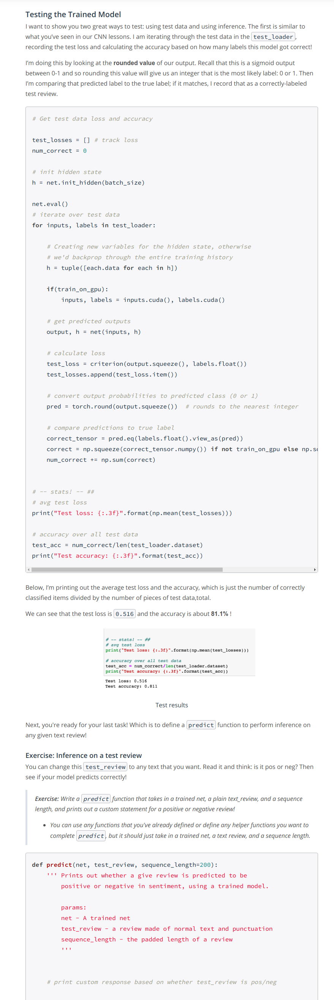
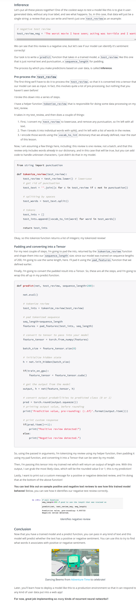

* Sentiment analysis is all about taking in some text such as movie reviews, and predicting the sentiment of that review, whether it's positive or negative.
* Refer: sentiment-rnn/Sentiment_RNN.ipynb
* 
* 
* 
* 
