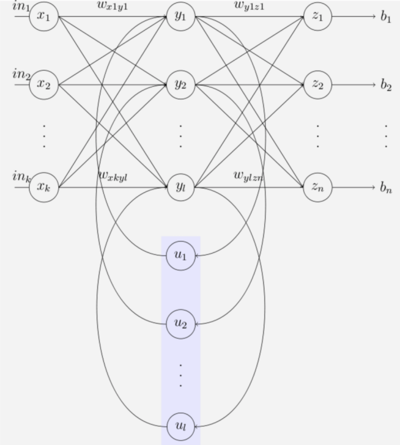

Feedforward neural networks are unable to capture temporal dependencies, dependencies which change over time. They were trained using the current inputs only. We did not consider previous inputs when generating the current output. In other words, our systems did not have any memory elements. RNNs address this very basic and important issue by using memory (i.e. past inputs to the network) when producing the current output.  Recurrent Neural Networks are the state of the art algorithm for sequential data and among others used by Apples Siri and Googles Voice Search. This is because it is the first algorithm that remembers its input, due to an internal memory, which makes it perfectly suited for Machine Learning problems that involve sequential data. 
Sequential data is basically just ordered data, where related things follow each other. Examples are financial data or the DNA sequence. The most popular type of sequential data is perhaps Time series data, which is just a series of data points that are listed in time order. 
[Nice detailed article](https://skymind.ai/wiki/lstm)

**But when do you need to use a Recurrent Neural Network ?**
> Whenever there is a sequence of data and that temporal dynamics that connects the data is more important than the spatial content of each individual frame. --- Lex Fridman (MIT)

Convolutional neural networks helps us in analyzing the spatial information in a given input image. They excel in finding spatial and visible patterns in training data while RNN's or recurrent neural networks helps us in incorporating memory(somewhat similar to sequential circuits in digital logic) into our neural networks, which will be critical in analyzing sequential data. RNN's are most often associated with text processing and text generation because of the way sentences are structured, as a sequence of words.

 * Some applications of RNN's:
   1. A model that takes in a series of words as input and outputs a likely next word, forming a text, one word at a time.

   1. Given a feature vector to RNN from an image, we can use it to [generate a descriptive caption](https://github.com/yunjey/pytorch-tutorial/tree/master/tutorials/03-advanced/image_captioning).

   3. One of the exciting use of RNN's is in generating drawings. [Sketch RNN](https://magenta.tensorflow.org/assets/sketch_rnn_demo/index.html) is a program that learns to complete a drawing, once you give it something (a line or circle, etc.) to start! [Some of the interesting applications worth looking](https://www.youtube.com/watch?v=6JbTNARuKII)

* Although RNNs help us in incorporating memory they have a key flaw, capturing relationships that span more than 8 or 10 steps back is practically impossible. This flaw stems from the "vanishing gradient" problem in which the contribution of information decays geometrically over time. **Meaning?** While training our network we use backpropagation. In the backpropagation process we adjust our weight matrices with the use of a gradient. In the process, gradients are calculated by continuous multiplications of derivatives. The value of these derivatives may be so small, that these continuous multiplications may cause the gradient to practically "vanish".  Long Short-Term Memory Cells (LSTMs) and Gated Recurrent Units (GRUs)  are used to overcome the Vanishing Gradient problem in RNNs.

-----------------------------------------------
*Digression to previous concepts*
* FFNN works as a nonlinear function approximator, which means we try to fit a smooth function between given data points in such a way that when we have a new input, we can find the new output. 
In feedforward neural networks, we have static mapping from inputs to outputs i.e. we have no memory and the output depends only on the current inputs and weights. In other words for the same inputs and the same weights we always receive the same outputs. [FFNN](https://www.youtube.com/watch?v=FfPjaGcZODc)  The two error functions that are most commonly used are the [Mean Squared Error](https://en.wikipedia.org/wiki/Mean_squared_error) (MSE) (usually used in regression problems) and the [cross entropy](https://www.ics.uci.edu/~pjsadows/notes.pdf) (usually used in classification problems).

* The gradient is the vector of partial derivatives of the error with respect to each of the weights.  If we have a finite training set then there is a risk of overfitting the data.  [Backpropagation - 1](https://www.youtube.com/watch?v=3k72z_WaeXg)  [Backpropagation - 2](https://www.youtube.com/watch?v=YAhIBOnbt54)  [Backpropagation - 3](https://www.youtube.com/watch?v=yiSwuMP2UIA)  
----------------------------------------------------------------------

* There are two main differences between FFNNs and RNNs. The Recurrent Neural Network uses:
    - sequences as inputs in the training phase, and
    - memory elements

 * Memory is defined as the output of hidden layer neurons, which will serve as additional input to the network during next training step. The basic three layer neural network with feedback that serve as memory inputs is called the [Elman Network](https://en.wikipedia.org/wiki/Recurrent_neural_network#Elman_networks_and_Jordan_networks) and is depicted in the following picture: 

 * [RNN: Folded and unfolded network](https://www.youtube.com/watch?v=wsif3p5t7CI) 

 * Backpropagation through Time  [Adjusting Ws](https://www.youtube.com/watch?v=bUU9BEQw0IA) 
 * [RNN Summary](https://www.youtube.com/watch?v=nXP0oGGRrO8) 

References:
1. [Medium: How Recurrent Neural Networks work by Simeon](https://towardsdatascience.com/learn-how-recurrent-neural-networks-work-84e975feaaf7)
2. [Recurrent Neural Networks (RNNs) blog](https://blog.paperspace.com/recurrent-neural-networks-part-1-2/)
3. [Medium: Recurrent Neural Networks and LSTM by Niklas](https://towardsdatascience.com/recurrent-neural-networks-and-lstm-4b601dd822a5)
4. [WILDML](http://www.wildml.com/2015/09/recurrent-neural-networks-tutorial-part-1-introduction-to-rnns/)
