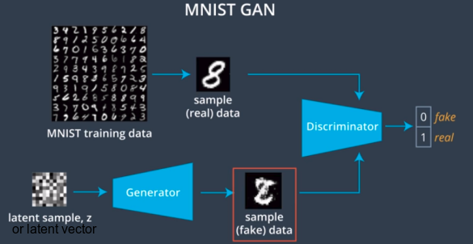

Now we'll built a GAN that generates new images of handwritten digits. Think for a moment how to solve a task like this. We know that we can create a classifier by training on a lot of MNIST images. *As the classifier trains, it will form some representation of the different digits.* It learns what features distinguish the different kinds of images. But, a network like this can't draw a new picture of a digit. Simply because it doesn't know how to. 

To generate new data, we want something that can learn the underlying structure of the training data, like what colors and shapes make up an image of a digit, and use that information to create something entirely new. Adversarial training gives us a way to do this.    
The idea is to have two neural networks, a generator, and a discriminator. The discriminator is a simple classifier that tries to classify images as either real from the training set, or fake generated images.  The generator acts as an adversary to the discriminator. It's aim is to trick the discriminator, giving it generated images that look as if they've come from the training set. If the generator produces an image that the discriminator thinks is fake, then it will change its behavior and try again.  The generator will train until it can fool the discriminator into thinking that its generated data comes from the real training set. So, its goal is to force the discriminator to have as high an error rate as possible. But, at the same time, the discriminator is also training. It's alternating between looking at examples of real and fake images, and getting better at recognizing differences between them.  It's goal is to have as low an error rate as possible. So, our task will be to define generator and discriminator networks with opposing goals. We'll formalize this idea by defining opposing generator and discriminator loss functions. By the end of training, the discriminator should not be able to tell the difference between real and fake images, and we'll be able to use our trained generator to create new images of handwritten digits. 

Refer: MNIST_GAN.ipynb

#### The universal approximation function
The universal approximation theorem states that a feed-forward network with a single hidden layer is able to approximate certain continuous functions. A few assumptions are made about the functions operating on a subset of real numbers and about the activation function applied to the output of this single layer. But this is very exciting! This theorem is saying that a simple, one-layer neural network can represent a wide variety of interesting functions. You can learn more about the theorem [here](https://en.wikipedia.org/wiki/Universal_approximation_theorem) .
