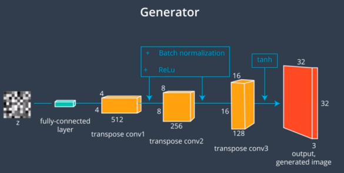
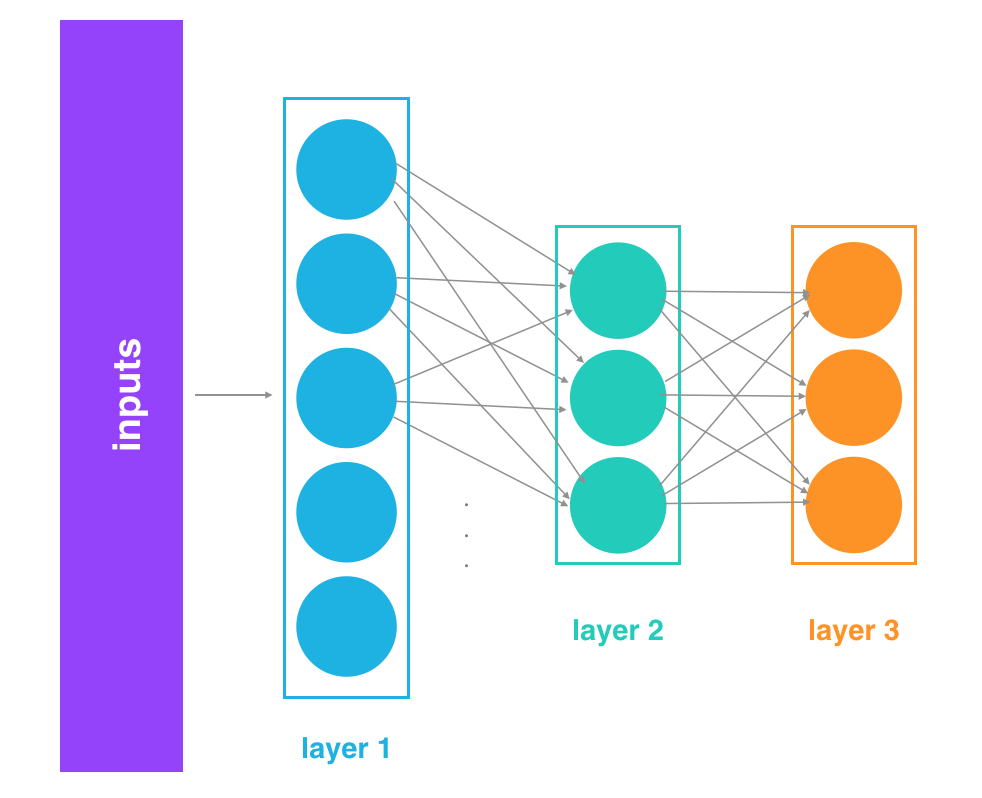
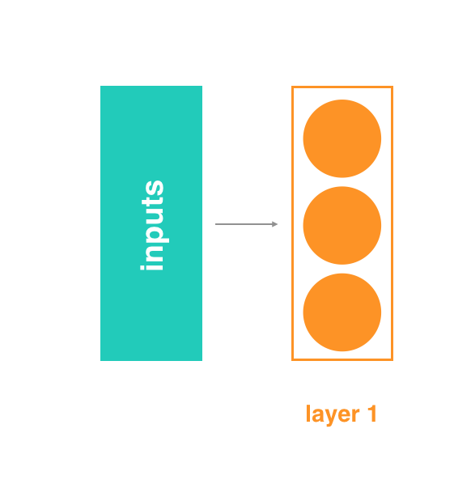

 * A DCGAN is made of two networks, a generator and a discriminator. We'll study discriminator first.   The discriminator is a convolutional neural network with one fully connected layer at the end. It takes in an image as input and output a value that indicates whether that image is real or fake.

 * Notice that, unlike most convolutional networks that we've seen, there are no maxpooling layers in this network. Instead, the down-sampling is done entirely with convolutional layers that have a stride equal to two. If the kernel moves over the image with a stride of two, then for every two pixels it sees in the input image, it will create one pixel in the output filtered image. Effectively, down-sampling the image by a factor of two.

 * Also all the hidden layers have something called batch normalization and leaky ReLu activations applied to their outputs.    A Leaky ReLu function will reduce any negative values it sees by multiplying those values by some smart coefficient, often called the negative slope. The batch normalization, scales the layer outputs to have a mean of zero and variance of one. By scaling the outputs to a consistent range, this normalization step helps the network train faster and reduces problems due to poor parameter initialization. Now, after a series of downsampling convolutional layers, the final convolutional layer is flattened and connected to a single sigmoid unit. To get an output and a range from zero to one, indicating whether an image is fake or real. So, this makes up the first part of a DCGAN, discriminator.

 * The generator's job is to learn something about the underlying structure of training data like what shape and color features make up the images and then it will learn to imagine in that space, combining these features in new ways to create realistic generated images. 

 * The input to the generator is a random vector Z, usually with something around a 100 values. The output of the generator, needs to be an image that can be sent to the discriminator meaning, we need to up-sample the vector Z until we get to an image that is of the same shape as our training images. We did something like this  in autoencoders in which we up-sampled a compressed input using nearest neighbor interpolation or transpose convolutional layers.

 * Here we're going to use what was found successful in the original paper of DCGAN model, transposed convolutions. Transposed convolutional layers are similar to the convolutions but with the opposite effect. With convolutional layers, we typically go from shallow and wide inputs to deep and narrow outputs, but with transposed convolutional layers, we go from narrow and deep inputs like vectors to wide and flat outputs like images.

 * Consider using a layer with a stride of two. When we move the convolutional kernel, one pixel in the input layer, the kernel will move two pixels in the output layer. With a stride of two, the transposed convolutional layer output will be twice the width and height of the input layer. For the generator, the authors of this original GAN paper use real activations and batch normalization on all hidden layers. The last layer is the only one that should not have batch normalization. Instead, we'll just be applying a tanh activation function to the outputs of the final layer. This will give us a desired output pixel values in a range from negative one to one. So, this completes our DCGAN architecture.
#### Batch Normalization
* Batch normalization was introduced in Sergey Ioffe's and Christian Szegedy's 2015 paper Batch Normalization: Accelerating Deep Network Training by Reducing Internal Covariate Shift. The idea is that, instead of just normalizing the inputs to the network, we normalize the inputs to every layer within the network.

* It's called "batch" normalization because, during training, we normalize each layer's inputs by using the mean and standard deviation (or variance) of the values in the current batch. These are sometimes called the batch statistics.
> Specifically, batch normalization normalizes the output of a previous layer by subtracting the batch mean and dividing by the batch standard deviation.

* Why might this help? Well, we know that normalizing the inputs to a network helps the network learn and converge to a solution. However, a network is a series of layers, where the output of one layer becomes the input to another. That means we can think of any layer in a neural network as the first layer of a smaller network.

* For example, imagine a 3 layer network.   Instead of just thinking of it as a single network with inputs, layers, and outputs, think of the output of layer 1 as the input to a two layer network. This two layer network would consist of layers 2 and 3 in our original network.   Likewise, the output of layer 2 can be thought of as the input to a single layer network, consisting only of layer 3.   When we think of it like this - as a series of neural networks feeding into each other - then it's easy to imagine how normalizing the inputs to each layer would help. It's just like normalizing the inputs to any other neural network, but we're doing it at every layer (sub-network).

* Beyond the intuitive reasons, there are good mathematical reasons to motivate batch normalization. It helps combat what the authors call internal covariate shift.
> In this case, internal covariate shift refers to the change in the distribution of the inputs to different layers. It turns out that training a network is most efficient when the distribution of inputs to each layer is similar! And batch normalization is one method of standardizing the distribution of layer inputs.

* Next, let's look into the math behind batch normalization.   Refer:Batch_Normalization.ipynb   

* By using batch normalization to normalize the inputs at each layer of a network, we can make these inputs more consistent and thus reduce oscillations that may happen in gradient descent calculations. This helps us build deeper models that also converge faster. Batch Normalization has been shown to have several benefits:
  - **Networks train faster** – Each training iteration will actually be slower because of the extra calculations during the forward pass and the additional hyperparameters to train during back propagation. However, it should converge much more quickly, so training should be faster overall.
  - **Allows higher learning rates** – Gradient descent usually requires small learning rates for the network to converge. And as networks get deeper, their gradients get smaller during back propagation so they require even more iterations. Using batch normalization allows us to use much higher learning rates, which further increases the speed at which networks train.
  - **Makes weights easier to initialize** – Weight initialization can be difficult, and it's even more difficult when creating deeper networks. Batch normalization seems to allow us to be much less careful about choosing our initial starting weights.
  - **Makes more activation functions viable** – Some activation functions do not work well in some situations. Sigmoids lose their gradient pretty quickly, which means they can't be used in deep networks. And ReLUs often die out during training, where they stop learning completely, so we need to be careful about the range of values fed into them. Because batch normalization regulates the values going into each activation function, non-linearlities that don't seem to work well in deep networks actually become viable again.
  - **Simplifies the creation of deeper networks** – Because of the first 4 items listed above, it is easier to build and faster to train deeper neural networks when using batch normalization. And it's been shown that deeper networks generally produce better results, so that's great.
  - **Provides a bit of regularization** – Batch normalization adds a little noise to our network. In some cases, such as in Inception modules, batch normalization has been shown to work as well as dropout. But in general, consider batch normalization as a bit of extra regularization, possibly allowing us to reduce some of the dropout we might add to a network.
  - **May give better results overall** – Some tests seem to show batch normalization actually improves the training results. However, it's really an optimization to help train faster, so we shouldn't think of it as a way to make our network better. But since it lets us train networks faster, that means we can iterate over more designs more quickly. It also lets us build deeper networks, which are usually better. So when we factor in everything, we're probably going to end up with better results if we build our networks with batch normalization.

**Now we train a DCGAN on street view house numbers or SVHN dataset collected from Google Street View to build new kinds of images.** Refer: DCGAN.ipynb

##### Why no bias ?
The reason there is no bias for our convolutional layers is because we have batch normalization applied to their outputs. The goal of batch normalization is to get outputs with:
 * mean = 0
 * standard deviation = 1 

Since we want the mean to be 0, we do not want to add an offset (bias) that will deviate from 0. We want the outputs of our convolutional layer to rely only on the coefficient weights. [Optimization Strategy](https://www.youtube.com/watch?v=US0HjU0alv4)   

 * [OpenAI](https://openai.com/blog/adversarial-example-research/) blog post that details how adversarial examples can be used to "attack" existing models, and discusses potential security issues. 

   

Further Reading:
  - [DCGAN_paper](https://arxiv.org/pdf/1511.06434.pdf)
  - From DCGAN paper: 
  - [Batch Normalization paper](https://arxiv.org/pdf/1502.03167.pdf)
