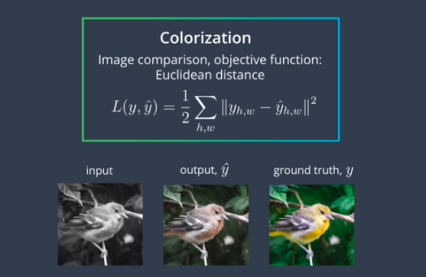
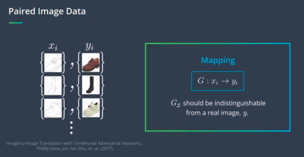
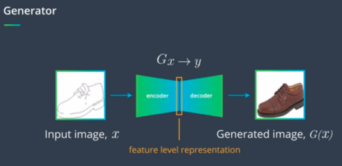
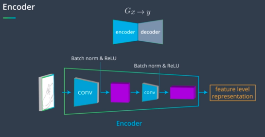
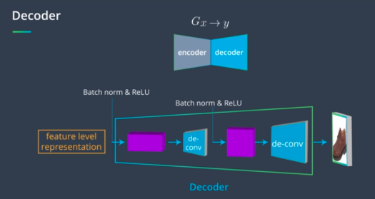
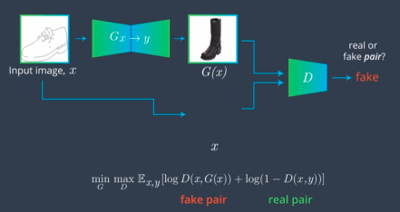
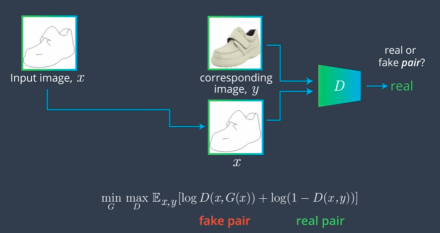
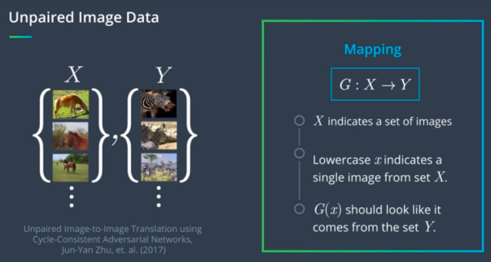
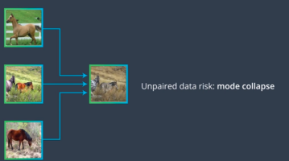
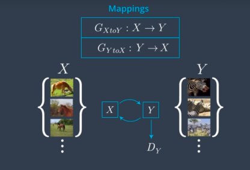

Let's look at an another task where GANs can be applied to: Image to Image Translation.  Image to Image translation
include a variety of computer vision applications such as semantic segmentation - in which every pixel in the input image is labeled as a cast like a car, bike, person or background pixel and the edge of bounded detection. In computer graphics there are also a number of applications wher we often want to translate an image into a new domain with a desired property. For example, automatically colouring greyscale image or make a low-risk image much sharper. We will go over how GANs are used in two specific formulations that aim to do image to image translation. Pix2Pix and Cycle GAN. These two formulations learn to transform an input image into a desired output.
 * Deep learning techniques have given us a way to take a data-driven approach to solving challenging tasks like object recognition and image classification. In image classification tasks, we take a set of training images with their ground truth class labels and then a classifier learns to produce accurate labels for those images ,typically by using cross entropy loss as a measure of error i.e. we have an objective functioning denoted by L, that measures the difference between a model prediction and the ground truth label.

 * What is a good way to measure the difference between two images? Doing a pixel by pixel comparison. For an input image X, and ground truth output image Y, we would like to look at the output of a model $\hat{Y}$ and compare pixel by pixel. This pixel distance is called Euclidean distance. This metric sounds reasonable, but in practice, it's a bit too simple. Since the Euclidean distance takes an average of squeal error terms between pixels, it has a tendency to blur an output image.  If we often want the content not just the appearance of an image to match up, the objective functioning that will help us translate one type of an image into another is not obvious.

 * A typical GAN aims to generate a realistic looking image from a latent vector z. In image to image translation tasks, we want a generator to look an input image and produce the desired output. The example of dataset might look like:  with sketches or edge as input images, x and complete target images, y.    So for an input image x and the desired output y, we want a generator to learn a mapping G between x and y. The mapping is just a mathematical transformation from one image into another. In this case, the mapping function G is a neural network, and we want $G(x)$ to generate an output that is indistinguishable from a true desired output image y.

 * Pix2Pix architecture uses a conditional generative adversarial network, CycleGAN, to learn a mapping from the input image to an output image. This architecture includes a generator and the discriminator, just like a typical GAN, but with a couple of differences.   The encoder is a series of convolutional and batch norm layers with some activation functions. The idea is that by compressing the input image, the encoder will learn to distill some information about the content of the input image and encode it into a smaller feature level representation.   Then, the decoder portion of generator, a series of convolutional layers and activation functions cleverly reverse the actions of the encoder layers. The decoder will look at the feature level or partitioning of a sketch image and use that to generate a realistic looking output image.    So in sum, the generator is responsible for applying a transformation to the input image x to generate output image. Once we have the generator, we can then link its output to the discriminator, which will try to characterize the image as real or fake as usual. But we still need a way for the discriminator to match the input image such as sketch of shoe to correct generated output image i.e. a sketch of shoe should not get linked with some realistic purse image. Even though the generated image is realistic, it's not of shoe.

 * So, in the Pix2Pix architecture, we need a way to associate an input image with its correct output image. We can modify the discriminator, so that instead of identifying a single image as real or fake, it will look at pairs of input and output images and output a value for a real pair or a fake pair.    This is where the pairs in training data comes in. During training, the discriminator will take an input image and the unknown image, that is either the target image y or generated image $G(x)$. By labeling a pair as fake or real, it tries to determine whether the output image is generated or not. The discriminator is acting on the loss function that is conditional on both the input and output images to the generator, which is why this is called conditional GAN.

 * In practice, paired data is intensive and difficult to collect, often require huge amounts of manual labor. There are only a few small datasets for semantic segmentation. In some scenarios, especially in stylized images, paired data is impossible to get. For example, if we would like to transform a horse to a zebra, we cannot ask a zebra to do the same pose with the same environment. So, researchers have studied ways to learn from unpaired data. We have a set of images of x and unpaired set y. We want to be able to translate an image from one set to another.   With unpaired data, we no longer have the ability to look at real and fake pairs of data, as we did with Pix2Pix.   

 * We know that we can train our model to produce an output that belongs to a target domain. So, for when we input image of a horse, we train a generator to produce realistic looking images of zebras. The problem with this, is we count forced output of generator to corresponding to its input, and we end up with a problem called mode collapse, in which a model might map multiple input horse into the same zebra.   In such cases, given a input horse, all we know is that the output should look like a zebra, and we can do this using an adversarial loss on the output. But, is this enough? Think about it!  There are many, many mappings that will satisfy such an unparalleled constraint. So, we need another constraint to make sure G in D is the correct mapping. We add an additional mapping, subtract validity of G. This has an inverse mapping, called G inverse that tries to map y to x. This is called cycle consistency constraint. 

 * Refer: [CycleGAN.ipynb](https://www.youtube.com/watch?v=pVBu1aL8evA)
 * [Generator and Residual Blocks](https://www.youtube.com/watch?v=AYIq7cUjLMs)
##### Residual Blocks
So far, we've mostly been defining networks as layers that are connected, one-by-one, in sequence, but there are a few other types of connections we can make! The connection that residual blocks make is sometimes called a skip connection. By summing up the output of one layer with the input of a previous layer, we are effectively making a connection between layers that are not in sequence; we are skipping over at least one layer with such a connection, as is indicated by the loop arrow below:   To learn more about residual blocks and especially their effect on ResNet image classification models, I suggest reading [this blog post](https://towardsdatascience.com/an-overview-of-resnet-and-its-variants-5281e2f56035), which details how ResNet (and its variants) work!
##### Skip Connections
More generally, skip connections can be made between several layers to combine the inputs of, say, a much earlier layer and a later layer. These connections have been shown to be especially important in image segmentation tasks, in which you need to preserve spatial information over time (even when your input has gone through strided convolutional or pooling layers). One such example, is in [this paper](https://arxiv.org/abs/1608.04117) on skip connections and their role in medical image segmentation.

* [Loss & Optimization](https://www.youtube.com/watch?v=-OO9pb8EyJI)
* [Training Loss & Generated Samples](https://www.youtube.com/watch?v=Cl3oSLG9dpA)

References:
 * Related work on creating high-res images: [high resolution, conditional GANs](https://tcwang0509.github.io/pix2pixHD/).
 * [Original Pix2Pix Paper](https://arxiv.org/pdf/1611.07004.pdf)
 * [iGAN: Interactive Image Generation via GAN](https://github.com/junyanz/iGAN/blob/master/README.md)
 * [Image to Image Demo](https://affinelayer.com/pixsrv/)
 * [Cycle GAN paper](https://arxiv.org/pdf/1703.10593.pdf)
