### Generative Adversarial Networks by Ian GoodFellow

##### Applications of GANs
GANs are used for generating realistic data. Most of the applications of GANs have been for images.
 * The **StackGAN model** is really great at taking a textual description of a bird and then generating a high resolution photo of a bird matching that description. These photos have never been seen before and are totally imaginary.  The GAN is actually drawing a sample from the probability distribution over all hypothetical images matching that description, so we can keep running the GAN to get more images.

 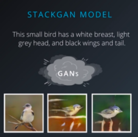

 * A tool called iGAN developed in collaboration between Berkeley and Adobe uses GANs to help artists. As the user draws very crude sketches using the mouse, iGAN searches for the nearest possible realistic image. 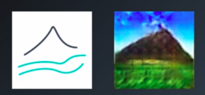   We see here that a scribble of green paint is turned into a lush grassland, and a black triangle is turned into a detailed mountain.

 * GANs can also be used for image to image translation where images in one domain can be turned into images in another domain.
    - Blueprints for buildings can be turned into photos of finished buildings.
    - Drawings of cats can be turned into realistic photos of cats. 

    What's even more exciting is that image-to-image translation models can be trained in an unsupervised way. Facebook AI researchers showed how to train a model that can turn a photo of a face into a cartoon of a face. The model was trained on photos and and on cartoons, but it did not need pairs of images showing which photo corresponds to which cartoon.

* GANs can also be used to create realistic simulated training sets or environments to train other machine learning models or reinforcement learning agents. Apple's first AI research paper was about using GANs to take 3D rendered images of eyes and change them to appear more realistic. These realistic images are useful for training computer vision models that can take an image of the user's eyes and estimate where the user is looking. 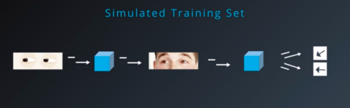
##### How GANs works

Generative adversarial networks are a kind of generative model. We've seen recurrent networks trained as generative models of text generating one word at a time. It's possible to make one word at a time, style models per images, where the model generates the image one pixel at a time. This strategy is called, 'fully visible belief networks' going back to the '90s' or auto regressive models now.
But we would like to generate an entire image in one shot? 
 * GANs are a kind of generative model that let's us generate a whole image in parallel. 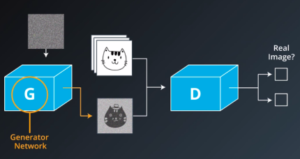

 * GANs use a differentiable function represented by a neural network as a generator network. The generator network takes random noise as input, runs that noise through a differentiable function to transform the noise and reshape it to have recognizable structure. The output of the generator network is a realistic image. The choice of the random input noise determines which image will come out of the generator network. Running the generator network with many different input noise values produces many different realistic output images. **The goal is for these images to be fair samples from the distribution over real data.**

* The generator net doesn't start out producing realistic images. It has to be trained. The training process for a generative model is very different from the training process for a supervised learning model. For a generative model, there's no output to associate with each image. **We just show the model a lot of images and ask it to make more images that come from the same probability distribution.** But how do we actually get the model to do that?

* Most generative models are trained by adjusting the parameters to maximize the probability that the generator net will generate the training data set. Unfortunately for a lot of interesting models, it can be very difficult to compute this probability. Most generative models get around that with some kind of approximation. GANs use an approximation where a second network, called the discriminator, learns to guide the generator.  The discriminator is just a regular neural net classifier. During the training process, the discriminator is shown real images from the training data half the time and fake images from the generator the other half of the time. The discriminator is trained to output the probability that the input is real. So it tries to assign a probability near 1 to real images, and a probability near zero to fake images.

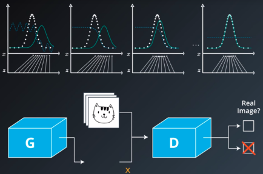

* Meanwhile the generator tries to do the opposite. It is trained to try to output images that the discriminator will assign probability near one of being real. Over time, the generator is forced to produce more realistic outputs in order to fool the discriminator. The generator takes random noise values Z and maps them to put values X. Wherever the generator maps more values of Z, the probability distribution over X, represented by the model, becomes denser.  
The discriminator outputs high values wherever the density of real data is greater than the density of generated data. The generator changes the samples it produces to move uphill along the function learned by the discriminator. In other words, the generator moves its samples into areas where the model distribution is not yet dense enough. Eventually the generator's distribution matches the real distribution, and the discriminator has to output a probability of one half everywhere because every point is equally likely to be generated by the real data set as to be generated by the model. The two densities are equal. [How GANs work](https://www.youtube.com/watch?v=MF0QCP1OC9I)

* [Games & Equilibrium](https://www.youtube.com/watch?v=2zi8DOWIVas)
##### Training GANs
* If we have a very simple task, like generating 28 by 28 pixel images of handwritten digits from the MNIST dataset, we can get away with a fully connected architecture.   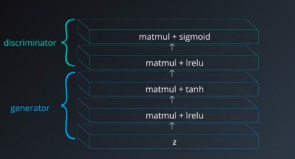  The most important design consideration for this architecture is to make sure that both the generator and the discriminator have at least one hidden layer to ensure that both models have a universal approximator property and can represent any probability distribution if given enough hidden units. For hidden units Leaky ReLUs are most popular activation functions since they make sure that the gradient flows through the entire architecture. And that's an important consideration for any machine learning model. But, it's even more important for GANs because the only way that generator can learn is to receive a gradient from the discriminator.

* A popular choice for the output of the generator is the hyperbolic tangent activation function. This means that our data scaled to the interval ranging from negative one to positive one. Finally, for most versions of GANs, the output of the discriminator needs to be a probability. To enforce that constraint, we use a sigmoid unit as the output.

* GANs require running two optimization algorithms simultaneously. We define a loss for the generator and a loss for the discriminator. Then, we use one optimizer to minimize the loss for the discriminator, while we simultaneously use another optimizer to minimize the loss for the generator. 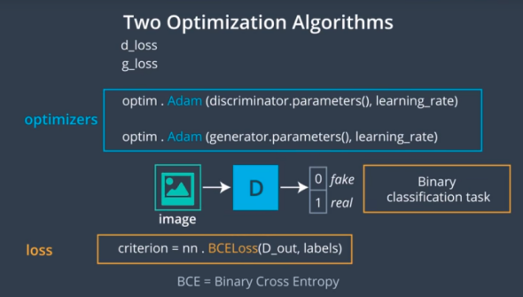  To setup the discriminator loss, we want to train the discriminator to output values near one for real data and near-zero for fake data. This is just a sigmoid cross entropy loss. 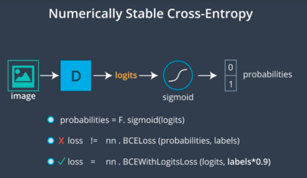  Remember to use the numerically stable version of cross-entropy where the loss is computed using the logits. The logits are the values produced by the discriminator right before the sigmoid. If we use the probability values that come out of the sigmoid, there can be problems with rounding error when the sigmoid is near zero or one. One GAN-specific trick is to multiply the zero or one labels by a number that is just a little bit smaller than one. This is GAN-specific version of the label smoothing strategy used to regularize normal classifiers. It helps the discriminator to generalize better and avoid learning to make extreme predictions when extrapolating.

* For the generator loss, we want to set up another cross-entropy loss, but with the labels flipped. In other words, the generator will maximize the log probability of the wrong labels. A lot of people like to use negative d-loss as the expression for g-loss. It's very intuitive because it corresponds to having the generator maximize the loss for the discriminator but it doesn't work very well in practice and it's actually not recommended to implement it for real because the gradient of d-loss is zero whenever the discriminator is winning. Using negative d-loss as the loss for g, forces that generator to maximize a cross-entropy and we really want both players to minimize the cross-entropy. Minimizing a cross-entropy works very well in practice because the derivative of the cross-entropy function is always non-zero whenever the cross entropy is not minimized. So, the losing player always gets gradient. That means it's much better for the generator to minimize the cross-entropy with the labels flipped rather than maximizing the discriminators' cross-entropy.

* To scale up classifiers to work on large images, we use convolutional networks. Convolutional networks replace some of the matrix multiplies in normal neural networks with convolutions. Similarly we replace the matrix multiplies in GANs with convolutions. 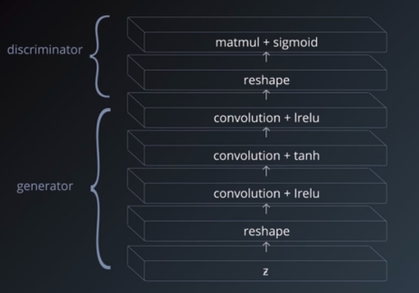   For the input to the GAN generator we usually use a random vector Z. A mini-batch of these vectors forms a matrix. The problem is, a convolution expects its mini-batch to be a 4D Tensor with one axis for different examples in the mini-batch, one axis for the different feature maps, and then the width and height axes. To get the random input into this format, we have to use a reshape operation near the start of that generator. For example, we might transform a mini-batch of vectors that each contain 1,000 entries into a stack of 10 feature maps that are each sized 10 by 10.

* Usually, convolutional nets changes the shape of the feature maps as we move through the network. The input to a convolutional net is a very tall and wide image with just three feature maps: the red, green, and blue color channels. After applying convolution and pooling several times, we end up with very short and narrow feature maps. That's all what happens when we use a classifier convolutional net.   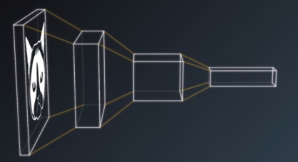  
When we use a convolutional net as a generator net, most researchers recommend we do the opposite. We start off with a small feature map and expand it to a wide and tall image. 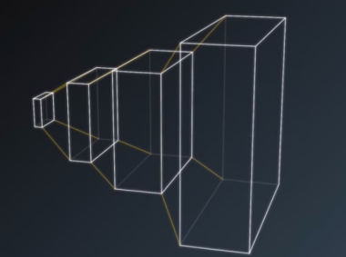 
To do this, we need to have an operation that can increase the width and the height of feature maps at every layer.

* The DCGAN Project introduced the idea of increasing the size of the feature maps just by using convolution transpose operations with stride greater than one. This just means that when we compute the convolution, every time we move the convolution kernel by one pixel in the input map we move it by two pixels or some other larger number of pixels in the output map. Finally, we should use batch normalization or one of the many follow-up methods based on batch normalization in most layers of the network. The DCGAN authors recommend using batch normalization on every layer except the output layer of the generator and the input layer of the discriminator. They also apply batch norm to all the real data in one mini-batch. Then, apply batch normalization separately to another mini-batch containing all the generated samples. That's a little bit weird from a theoretical point of view because it means we use a different discriminator function based on different batch statistics for real data than we use for generated data. Despite being a little bit weird, it seems to work well in practice.

* Overall, this recipe of using convolution transpose, batch normalization, Adam and cross-entropy losses with label smoothing works fairly well in practice. Let's now implement our MNIST GAN model.  
