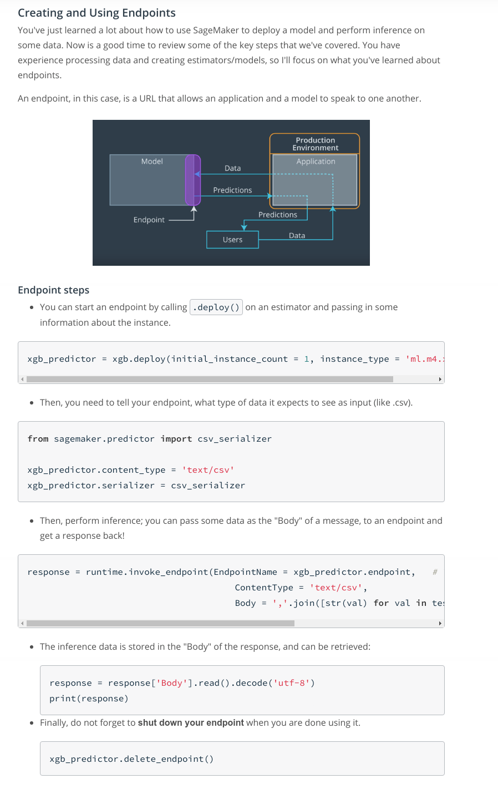
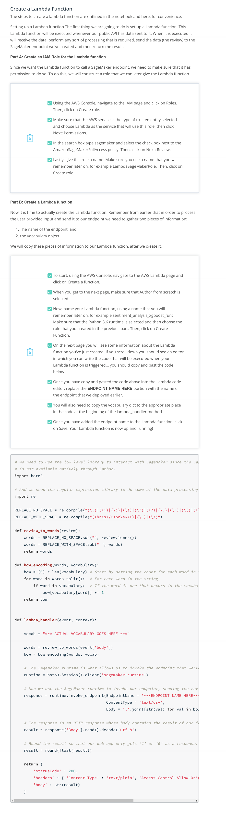

 Refer: IMDB Sentiment Analysis - XGBoost - Web App.ipynb

* [Deploying and Using a Sentiment Analysis Model](https://www.youtube.com/watch?v=r7XVQEojRKk) You've learned how to create and train models in SageMaker and how you can deploy them. In this example we are going to look at how we can make use of a deployed model in a simple web app. In order for our simple web app to interact with the deployed model we are going to have to solve a couple problems. 
    - The first obstacle is something that has been mentioned earlier. The endpoint that is created when we deploy a model using SageMaker is secured, meaning that only entities that are authenticated with AWS can send or receive data from the deployed model. This is a problem since authenticating for the purposes of a simple web app is a bit more work than we'd like.
    - The second obstacle is that our deployed model expects us to send it a review after it has been processed. That is, it assumes we have already tokenized the review and then created a bag of words encoding. However, we want our user to be able to type any review into our web app.
* To solve these issues we are going to need to use some additional Amazon services. In particular, we are going to look at Amazon Lambda and API Gateway.

* I mentioned that one of our tasks will be to convert any user input text into data that our deployed model can see as input. You've seen a few examples of text pre-processing and the steps usually go something like this:
  - Get rid of any special characters like punctuation
  - Convert all text to lowercase and split into individual words
  - Create a vocabulary that assigns each unique word a numerical value or converts words into a vector of numbers. This is often called word tokenization or vectorization.
* We'll be vectorizing words using a method called [bag of words](https://www.youtube.com/watch?v=A7M1z8yLl0w). You can read more about the bag of words model, and its applications, [on this page](https://en.wikipedia.org/wiki/Bag-of-words_model). It's a useful way to represent words based on their frequency of occurrence in a text.
* [Building and Deploying the Model](https://www.youtube.com/watch?v=JCiQhhXbeuc)
#### Don't forget to SHUT DOWN your endpoint!
* [How to Use a Deployed Model](https://www.youtube.com/watch?v=WTwj-7XcTro) As mentioned earlier, there are two obstacles we are going to need to overcome. The first is the security issue and the second is data processing. The way that we are going to approach solving these issues is by making use of Amazon Lambda and API Gateway.   The structure for our web app will look like the diagram below. 
* What this means is that when someone uses our web app, the following will occur.
    1. To begin with, a user will type out a review and enter it into our web app.
    2. Then, our web app will send that review to an endpoint that we created using API Gateway. This endpoint will be constructed so that anyone (including our web app) can use it.
    3. API Gateway will forward the data on to the Lambda function.
    4. Once the Lambda function receives the user's review, it will process that review by tokenizing it and then creating a bag of words encoding of the result. After that, it will send the processed review off to our deployed model.
    5. Once the deployed model performs inference on the processed review, the resulting sentiment will be returned back to the Lambda function.
    6. Our Lambda function will then return the sentiment result back to our web app using the endpoint that was constructed using API Gateway.
##### Don't forget!
Currently our endpoint is running. The reason for this is that in the next few videos we are going to interact with our deployed endpoint. If you are following along, don't forget that your endpoint is running. If you need to take a break, don't forget to shut down your endpoint!
* Review 
* [Building a Lambda function](https://www.youtube.com/watch?v=jOXETK4AerU) In general, a Lambda function is an example of a 'Function as a Service'. It lets you perform actions in response to certain events, called triggers. Essentially, you get to describe some events that you care about, and when those events occur, your code is executed.   For example, you could set up a trigger so that whenever data is uploaded to a particular S3 bucket, a Lambda function is executed to process that data and insert it into a database somewhere.   One of the big advantages to Lambda functions is that since the amount of code that can be contained in a Lambda function is relatively small, you are only charged for the number of executions.   In our case, the Lambda function we are creating is meant to process user input and interact with our deployed model. Also, the trigger that we will be using is the endpoint that we will create using API Gateway.
* Creating a lambda function 
* [Building an API](https://www.youtube.com/watch?v=AzBQ-aDQSG4) At this point we've created and deployed a model, and we've constructed a Lambda function that can take care of processing user data, sending it off to our deployed model and returning the result. What we need to do now is set up some way to send our user data to the Lambda function.   The way that we will do this is using a service called API Gateway. Essentially, API Gateway allows us to create an HTTP endpoint (a web address). In addition, we can set up what we want to happen when someone tries to send data to our constructed endpoint.   In our application, we want to set it up so that when data is sent to our endpoint, we trigger the Lambda function that we created earlier, making sure to send the data to our Lambda function for processing. Then, once the Lambda function has retrieved the inference results from our model, we return the results back to the original caller.
* [Using the Final Web Application](https://www.youtube.com/watch?v=VgG41Q_a15I)
##### Some notes on Lambda and Gateway usage
For Lambda functions you are only charged per execution, which for this class will be very few and still within the free tier. Deleting a lambda function is just a good cleanup step; you won't be charged if you just leave it there (without executing it). Similarly, for APIs created using API Gateway you are only charged per request, and the number of requests we require in this course should still fall under the free tier.
