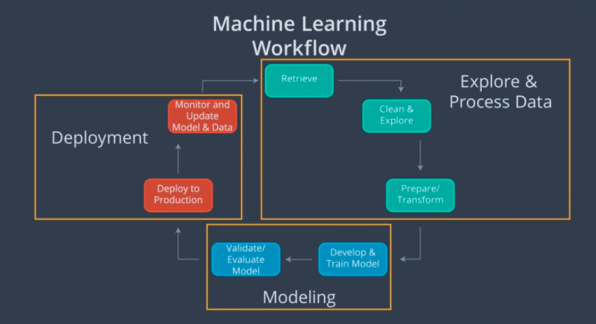

### Machine Learning Workflow

* Using cloud computing services provide secure supercomputing capability for big data analytics that we can could build and manage alone. With this deployment section, we'll be developing, training, validating, and deploying machine learning models using *[Amazon SageMaker service](https://aws.amazon.com/sagemaker/).* While we'll use SageMaker for deployment, the skills we'll be learning are applicable to any production environment that aims to deploy machine learning models, and deep learning models with Python.

 * We'll keep the tutorial platform-neutral, to get a good foundation in deployment so that we're able to apply this knowledge using any Cloud Platform in the future. With this tutorial, we'll begin with an understanding of Cloud Computing. Next, we'll focus on how machine learning is typically used in the workplace. Deployment is a critical part of the machine learning workflow in the workplace. With the final lesson, we'll examine deployment, and how it fits within the machine learning workflow.

 * Amazon SageMaker is just one method for deploying machine learning models. Specifically we will look at answering the following questions:
      - What's the machine learning workflow?
      - How does deployment fit into the machine learning workflow?
      - What is cloud computing?
      - Why would we use cloud computing for deploying machine learning models?
      - Why isn't deployment a part of many machine learning curriculums?
      - What does it mean for a model to be deployed?
      - What are the essential characteristics associated with the code of deployed models?
      - What are different cloud computing platforms we might use to deploy our machine learning models?

 * Let's say we want to deploy our trained model some smart phone application that we've developed. A common approach is to use the machine learning workflow.  
 * Machine learning workflow is composed of three components:
    - **Explore and process the data:**  The first step is to retrieve the data which basically involves downloading the data. Next, we'll clean the data and explore the data. This involves exploring and visualizing our data to identify the most promising features.The data may also have to be cleaned to identify and remove any anomalous values such as outliers or mistakes. The final step of this component is to prepare and transform the data. Most machine learning models expect standardized data values. Therefore, this step often involves normalizing and converting the format of the data. In addition, this step is where the data is split into training, validation, and test datasets. Remember, the training dataset is used to train the model. The validation dataset is used for model tuning and selection. The test dataset is used after training for evaluation of the model.

    - **Modeling:** The next component, modeling, focuses on developing the model that's deployed to production. The first step is where the model is developed and trained using the training dataset. The final step of modelling is to evaluate and validate the model. In this step, we'll tune the model using the validation data set. We also select the best model if we've developed more than one train model in the previous step. The final step is to evaluate your model using the test dataset.

    - **Deployment:** The final component of deployment focuses on deploying, monitoring, and updating the model in the production environment. This is the component we'll be focusing on in the tutorial. We'll start with deploying the model to the production environment. Simply put, this means making your model available for use by web or software application. The final step is to monitor and update the deployed model. Application users can access the updated model by downloading the updated application.
* The cyclical nature of the workflow enables user data captured during deployment to be used to create new models. Specifically, the data captured during deployment can be explored and processed in the first component then used to develop a new model on the second component, and finally, deploy to the production environment in the third component of the machine learning workflow. Model deployment is often a critical aspect of machine learning in the workplace that's why it's good to keep the machine learning workflow in mind.

##### References
Below are links that provide more detailed information on the Machine Learning Workflow that we discussed in this section above, described by cloud providers: Amazon, Google, and Microsoft.

  1. [Amazon Web Services (AWS)](https://aws.amazon.com/) discusses their definition of the [Machine Learning Workflow](https://docs.aws.amazon.com/sagemaker/latest/dg/how-it-works-mlconcepts.html).

  2. [Google Cloud Platform (GCP)](https://cloud.google.com/) discusses their definition of the [Machine Learning Workflow](https://cloud.google.com/ml-engine/docs/tensorflow/ml-solutions-overview).

  3. [Microsoft Azure (Azure)](https://azure.microsoft.com/en-us/) discusses their definition of the [Machine Learning Workflow](https://docs.microsoft.com/en-us/azure/machine-learning/service/overview-what-is-azure-ml).
