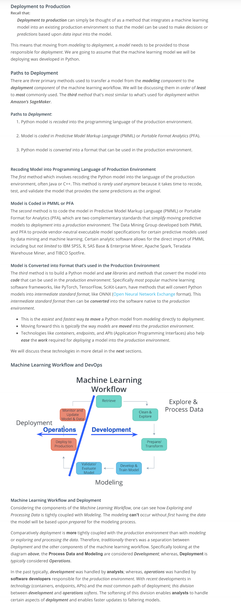

### [Machine Learning Applications](https://www.youtube.com/watch?v=Q4rgQo6ofoc)

* All algorithms used within the machine learning workflow are similar for both the cloud and on-premise computing. The only real difference may be in the user interface and libraries that will be used to execute the machine learning workflow.

* For personal use, one’s likely to use cloud services, if they don’t have enough computing capacity.

* With academic use, quite often one will use the university’s on-premise computing resources, given their availability. For smaller universities or research groups with few funding resources, cloud services might offer a viable alternative to university computing resources.

* For workplace usage, the amount of cloud resources used depends upon an organization’s existing infrastructure and their vulnerability to the risks of cloud computing. A workplace may have security concerns, operational governance concerns, and/or compliance and legal concerns regarding cloud usage. Additionally, a workplace may already have on-premise infrastructure that supports the workflow; therefore, making cloud usage an unnecessary expenditure. Keep in mind, many progressive companies may be incorporating cloud computing into their business due to the business drivers and benefits of cloud computing.

* Paths to Deployment 
* Deployment within Machine Learning Curriculum
Deployment is not commonly included in machine learning curriculum. This likely is associated with the analyst's typical focus on Exploring and Processing Data and Modeling, and the software developer's focusing more on Deployment and the production environment. Advances in cloud services, like [SageMaker](https://aws.amazon.com/sagemaker/) and [ML Engine](https://cloud.google.com/ml-engine/), and deployment technologies, like Containers and REST APIs, allow for analysts to easily take on the responsibilities of deployment.

* [Production Environments](https://www.youtube.com/watch?v=BH23Me3bbF4) 
* So communication between the application and the deployed model is done through the endpoint (interface), where the endpoint is a REST API.
