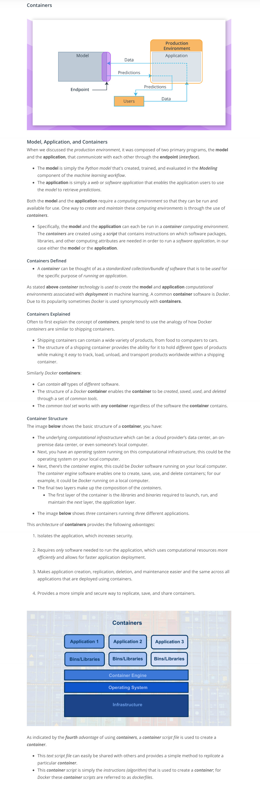

### Containers

* Containers: 
* This is shown with the image below, where the container engine uses a container script to create a container for an application to run within. These container script files can be stored in repositories, which provide a simple means to share and replicate containers. For Docker, the [Docker Hub](https://hub.docker.com/explore/) is the official repository for storing and sharing dockerfiles. Here's an example of a [dockerfile](https://github.com/pytorch/pytorch/blob/master/docker/pytorch/Dockerfile) that creates a docker container with Python 3.6 and PyTorch installed. 
