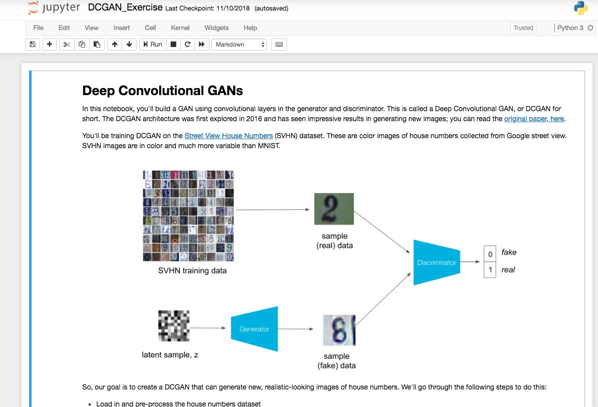
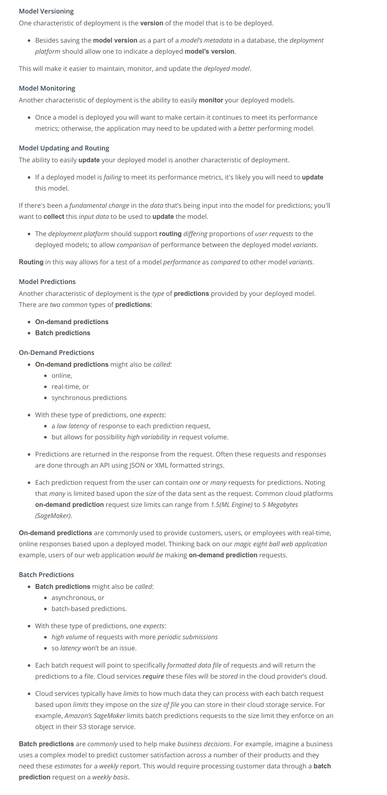

Below is an image of a Workspace environment that contains a Jupyter notebook. The Workspace environment makes use of containers so that you can run PyTorch, Numpy, Pandas, without having to install those Python packages.  [Containers](https://www.youtube.com/watch?v=XimuK3WHOH4)

* Deployment to production can simply be thought of as a method that integrates a machine learning model into an existing production environment so that the model can be used to make decisions or predictions based upon data input into this model. A production environment can be thought of as a web, mobile, or other software application that is currently being used by many people and must respond quickly to those users’ requests. There are a number of characteristics of deployment and modeling that are provided as features, made easier to use within cloud platforms services than if implemented with our own code.

#### Characteristics of Modeling
 
In machine learning, a hyperparameter is a parameter whose value cannot be estimated from the data.

* Specifically, a hyperparameter is not directly learned through the estimators; therefore, their value must be set by the model developer. This means that hyperparameter tuning for optimization is an important part of model training.
* Often cloud platform machine learning services provide methods that allow for automatic hyperparameter tuning for use with model training.
* If the machine learning platform fails to offer an automatic hyperparameter option, one option is to use methods from [scikit-learn](https://scikit-learn.org/stable/) Python library for hyperparameter tuning. Scikit-learn is a free machine learning Python library that includes methods that help with [hyperparameter tuning.](https://scikit-learn.org/stable/modules/grid_search.html#)
#### Characteristics of Deployment
 
