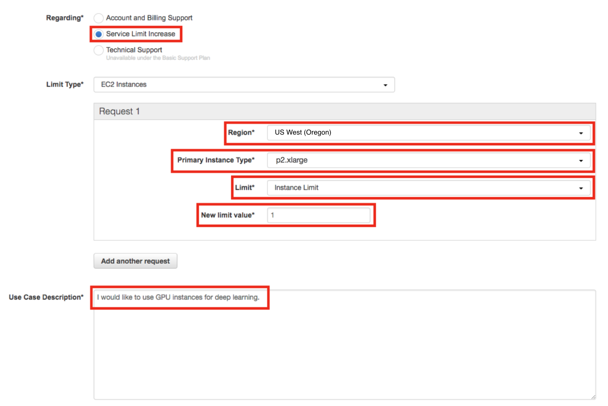

### [Introduction to Amazon SageMaker](https://www.youtube.com/watch?v=nJCc4_9-iAQ)

##### Create an AWS Account
* First, visit [Amazon AWS](https://aws.amazon.com/) and click on the Create an AWS Account button.
* If you have an AWS account already, sign in.

* If you do not have an AWS account, sign up.

* When you sign up, you will need to provide a credit card. But don’t worry, you won’t be charged for anything yet.

* Furthermore, when you sign up, you will also need to choose a support plan. You can choose the free Basic Support Plan.

* Once you finish signing up, wait a few minutes to receive your AWS account confirmation email. Then return to [Amazon AWS](https://aws.amazon.com/) and sign in.

* In the future, you can access the AWS console by visiting [console.aws.amazon.com](https://console.aws.amazon.com/). The AWS console is a central hub from which you can access all of the various Amazon Web Services, including SageMaker.
* Since it can sometimes take a few days for Amazon to approve a limit request which would allow you to use GPU machines, it is a good idea to start this process now so that it's ready when you need it.

* The smallest GPU instance available when using SageMaker is the **ml.p2.xlarge** instance. Depending on the default region that was used during the creation of your AWS account the default number of **ml.p2.xlarge** instances allowed may be 0.
* You can view your limit by looking at the EC2 Service Limit report which can be found here https://console.aws.amazon.com/ec2/v2/home?#Limits.   Scroll down and check your current **p2.xlarge** limit.
##### Submit a Limit Increase Request
* If your current limit is 0 you will need to request a limit increase.
* In order to request a limit increase you will need to know the region in which you would like the instance to operate. You will most likely want this to be the current region for your account. You can find the current region for your account by looking in the top right corner of EC2 Service Limits page (or most other AWS console pages).

* To submit a limit increase request, click on **Request limit increase** next to **p2.xlarge** on the EC2 Service Limits page.   On the service request form you will need to complete several fields.   For the **Region** field, select the AWS region found above.   For the **New limit value** field, enter a value of 1 (or more, if you wish).   For the **Use Case Description**, you can simply state: "I would like to use GPU instances for deep learning." 

> Note: If you have never launched an instance of any type on AWS, you might receive an email from AWS support asking you to initialize your account by creating an instance before they approve the limit increase. This can be done, for example, by creating and running a SageMaker Notebook instance.

#### Setting up a Notebook Instance
The first thing we are going to need to do is set up a notebook instance!

This will be the primary way in which we interact with the SageMaker ecosystem. Of course, this is not the only way to interact with SageMaker's functionality, but it is the way that we will use in this module.

The video below guides you through setting up your first notebook instance. Also, if you prefer to read the instructions instead, these have been provided underneath the video. [Notebook Instance](https://www.youtube.com/watch?v=TRUCNy5Eqjc)

#### Searching for SageMaker
Your main console page may look slightly different than in the above example. You should still be able to find **Amazon SageMaker** by either:
  1. Clicking on All Services then scrolling down and navigating to Machine Learning> Amazon SageMaker, or
  2. By searching for SageMaker, as in the below screenshot (and clicking on it). 

#### Creating and Running a Notebook Instance
First, start by logging in to the [AWS console](https://console.aws.amazon.com/), opening the SageMaker dashboard, selecting **Notebook Instances** and clicking on **Create notebook instance**.

You may choose any name you would like for your notebook. Also, using **ml.t2.medium** should be all that is necessary for the notebooks that you will encounter in this module. In addition, an **ml.t2.medium** instance is covered under the free tier.

Next, under **IAM role** select **Create a new role**. You should get a pop-up window that looks like the one below. The only change that needs to be made is to select **None** under **S3 buckets you specify**, as is shown in the image below. 

Once you have finished setting up the role for your notebook, your notebook instance settings should look something like the image below. 

> Note: Your notebook name may be different than the one displayed and the IAM role that appears will be different.

Now scroll down and click on **Create notebook instance**.

Once your notebook instance has started and is accessible, click on **open** to get to the Jupyter notebook main page.

##### Getting the Notebooks
Recently, SageMaker has added a line in the setup code to link directly to a Github repository and it's recommended that you use that setup!

Also on the **Actions** list, you should select **Open Jupyter** to get to the examples notebooks. from the dropdown menu, you'll still be able to see the **Stop action**.

Now that your notebook instance has been set up and is running, it's time to get the notebooks that we will be using during this module.

These notebooks are stored in a [repository on Github](https://github.com/udacity/sagemaker-deployment) and the easiest way to make them available inside of your notebook instance is to use **git** and clone the repository.

The video below goes through this process. Also, if you would prefer to read the instructions, these have been provided and can be found underneath the video. [Instructions](https://www.youtube.com/watch?v=jqL74whe9yo)

##### Cloning the Deployment Notebooks
In order to clone the deployment repository into your notebook instance, click on the **new** drop down menu and select **terminal**. By default, the working directory of the terminal instance is the home directory, however, the Jupyter notebook hub's root directory is under SageMaker. Enter the appropriate directory and clone the repository as follows:

>cd SageMaker

>git clone https://github.com/udacity/sagemaker-deployment.git

>exit

After you have finished, close the terminal window.

Your notebook instance is now set up and ready to be used.
##### SageMaker Sessions & Execution Roles
SageMaker has some unique objects and terminology that will become more familiar over time. There are a few objects that you'll see come up, over and over again:
 * Session - A session is a special object that allows you to do things like manage data in S3 and create and train any machine learning models; you can read more about the functions that can be called on a session, [at this documentation](https://sagemaker.readthedocs.io/en/latest/session.html). The upload_data function should be close to the top of the list! You'll also see functions like train, tune, and create_model all of which we'll go over in more detail, later.
 * Role - Sometimes called the execution role, this is the IAM role that you created when you created your notebook instance. The role basically defines how data that your notebook uses/creates will be stored. You can even try printing out the role with print(role) to see the details of this creation.

 ##### Uploading to an S3 Bucket
 Another SageMaker detail that is new is the method of data storage. In these instances, we'll be using S3 buckets for data storage.

 >S3 is a virtual storage solution that is mostly meant for data to be written to few times and read from many times. This is, in some sense, the main workhorse for data storage and transfer when using Amazon services. These are similar to file folders that contain data and metadata about that data, such as the data size, date of upload, author, and so on.

S3 stands for Simple Storage Service (S3).

After you upload data to a session, you should see that an S3 bucket is created, as indicated by an output like the following:
>INFO: sagemaker: Created S3 bucket: <message specific to your locale, ex. sagemaker-us-west-1-#>

If you'd like to learn more about how we're creating a csv file, you can check out [the pandas documentation](https://pandas.pydata.org/pandas-docs/stable/generated/pandas.concat.html). Above, we are just concatenating x and y data sets as columns of data **(axis=1)** and converting that pandas dataframe into a csv file using **.to_csv**.
