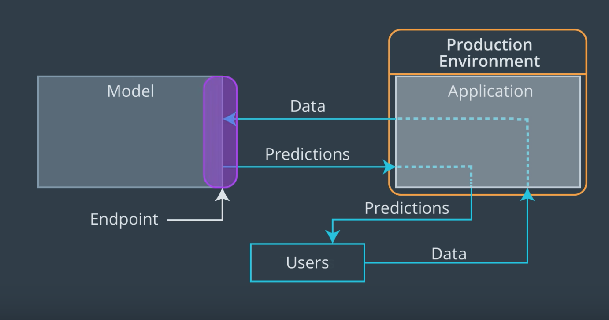

## Deploying a Model in SageMaker
In this lesson, we're going to take a look at how we can use a model that has been created in SageMaker. We will do this by first deploying our model. For us, this means using SageMaker's functionality to create an endpoint that will be used as a way to send data to our model.

>Recall, from the first lesson in this section, that an endpoint is basically a way to allow a model and an application to communicate. An application, such as a web app, will be responsible for accepting user input data, and through an endpoint we can send that data to our model, which will produce predictions that can be sent back to our application!

For our purposes an endpoint is just a URL. Instead of returning a web page, like a typical url, this endpoint URL returns the results of performing inference. In addition, we are able to send data to this URL so that our model knows what to perform inference on. We won't go too far into the details of how this is all set up since SageMaker does most of the heavy lifting for us.

An important aspect that we will encounter is that SageMaker endpoints are secured. In this case, that means that only other AWS services with permission to access SageMaker endpoints can do so.

To start with, we won't need to worry about this too much since we will be working inside of a SageMaker notebook and so we will be able to access our deployed endpoints easily.

Later on we will talk about how to set things up so that a simple web app, which doesn't need to be given special permission, can access our SageMaker endpoint.
* Refer: Boston Housing - XGBoost (Deploy) - High Level.ipynb
* [Deploy the model - High Level approach](https://www.youtube.com/watch?v=0PBsV-SzSlo) Using the high level approach makes deploying a trained model pretty straightforward. All we need to do is call the deploy method and SageMaker takes care of the rest.   Similarly, sending data to the deployed endpoint and capturing the resulting inference is easy too as SageMaker wraps everything up into the predict method, provided we make sure that our data is serialized correctly. In our case, serializing means converting the data structure we wish to send to our endpoint into a string, something that can be transferred using HTTP.
* **WARNING - SHUT DOWN YOUR DEPLOYED ENDPOINT** 
Sorry for the yelling, but this is pretty important. The cost of a deployed endpoint is based on the length of time that it is running. This means that if you aren't using an endpoint you really need to shut it down.

* Now we will look at deploying a model using the low level approach. This method requires us to describe the various properties that our endpoint should have and what inference code and model should be used. [Deploy the model - Low Level approach](https://www.youtube.com/watch?v=1lzWAzypJ9k)
* Refer: Boston Housing - XGBoost (Deploy) - Low Level.ipynb
* Using the low level approach to deploy our model requires us to create an endpoint, which will be used to send data to our model and to get inference results.   In order to create an endpoint in SageMaker, we first need to describe an endpoint configuration. This describes to SageMaker the various properties we want our endpoint to have. Once we've created the endpoint configuration we can ask SageMaker to create an endpoint with the properties we want.   The actual endpoint that is created by SageMaker is a combination of a compute instance (some remote server) running a docker container with the inference code on it and a URL that data can be sent to and returned from. This URL is used as an interface to the compute instance, which receives data, performs inference using our model and returns the result.
