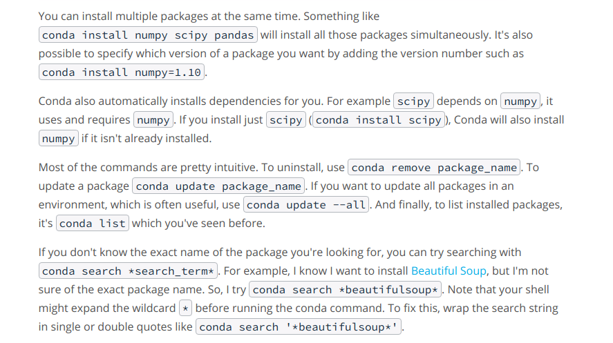
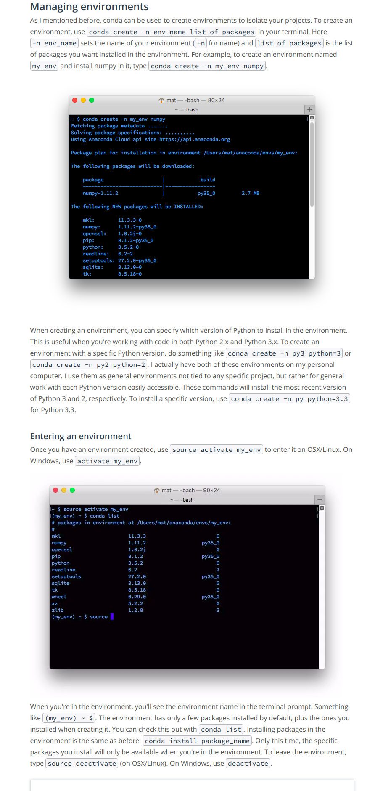
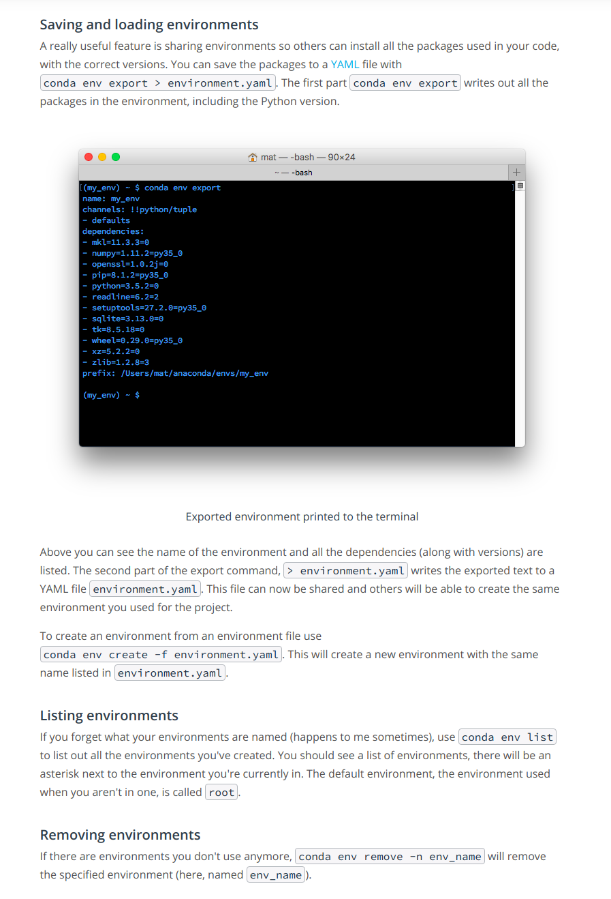

# Introduction-to-Deep-Learning

### Tutorail on Anaconda

Anaconda is a Python Data Science platform to manage packages and environments for use with Python. With Anaconda, it's simple to install the packages we'll often use in data science work. We'll use it to create virtual environments that make working on multiple projects much less mind-twisting.
 
 
Anaconda is  a distribution of software that comes with conda, Python, and over 150 scientific packages and their dependencies. The application conda is a package and environment manager.

 * Package managers are used to install libraries and other software on your computer.Conda is similar to pip except that the available packages are focused around data science while pip is default package manager for Python libraries.Conda is not Python specific like pip is, it can also install non-Python packages. It is a package manager for any software stack.

 * Environments allow you to separate and isolate the packages you are using for different projects. Often you’ll be working with code that depends on different versions of some library. For example, you could have code that uses new features in Numpy, or code that uses old features that have been removed. It’s practically impossible to have two versions of Numpy installed at once. Instead, you should make an environment for each version of Numpy then work in the appropriate environment for the project.

**Now, we'll get into the details of using Anaconda**  
A bunch of applications gets installed along with Anaconda:
 * Anaconda Navigator-- a GUI for managing your environments and packages.
 * Anaconda Prompt(usual terminal for ubuntu)-- a terminal where you can use the command line interface to manage your environments and packages.
 * Spyder-- an IDE geared toward scientific development
___
To avoid errors later, it's best to update all the packages in the default environment. Open the Anaconda Prompt application. In the prompt, run the following commands:

&nbsp;&nbsp;&nbsp;&nbsp;&nbsp;&nbsp;&nbsp;&nbsp;&nbsp;&nbsp;&nbsp;&nbsp;&nbsp;&nbsp;&nbsp;&nbsp;&nbsp;&nbsp;&nbsp;&nbsp;&nbsp;**conda upgrade conda** 
  &nbsp;&nbsp;&nbsp;&nbsp;&nbsp;&nbsp;&nbsp;&nbsp;&nbsp;&nbsp;&nbsp;&nbsp;&nbsp;&nbsp;&nbsp;&nbsp;&nbsp;&nbsp;&nbsp;&nbsp;         **conda upgrade --all**
  ___
 * To install a package, type **conda install ~~package_name~~** in your terminal. For example, to install numpy, type **conda install numpy**
 * 

 * Managing Envirnments 

 * More options 

**Note:**
 *Remember that when you set up an environment initially, you'll only start with the standard packages and whatever packages you specify in your conda create statement.It's also useful to create environments for each project you're working on.When sharing your code on GitHub, it's good practice to make an environment file and include it in the repository. This will make it easier for people to install all the dependencies for your code.
 You can include a pip requirements.txt file using pip freeze [learn more here](https://pip.pypa.io/en/stable/reference/pip_freeze/) for people not using conda.*
