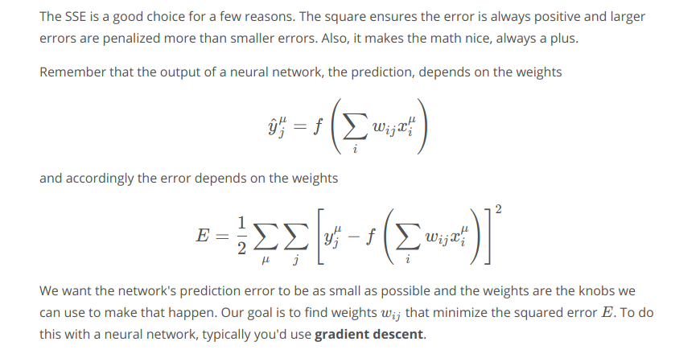
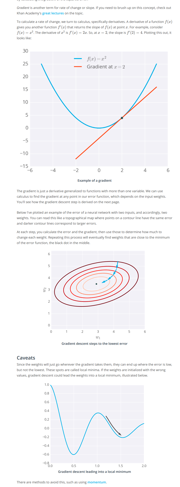

There are many error functions used for neural networks. We have already seen log-loss error function. Let us discuss another one called mean squared error function. As the name says, this one is the mean of the squares of the differences between the predictions and the labels.

Let's start by thinking about the goal. The network needs to make predictions as close as possible to the real values by tuning the weights and biases of our neural network. To measure this, we use a metric of how wrong the predictions are, the error.  
 * A common metric is the sum of the squared errors (SSE): 
$E = \frac{1}{2}\sum_{\mu} \sum_j \left[ y^{\mu}_j - \hat{y} ^{\mu}_j \right]^2$
 where $\hat y$ is the prediction and $y$ is the true value, and we take the sum over all output units $j$ and another sum over all data points $\mu$.  

 * Mean Square Error -- $E = \frac{1}{2m}\sum_{\mu} \sum_j \left[ y^{\mu}_j - \hat{y} ^{\mu}_j \right]^2$
