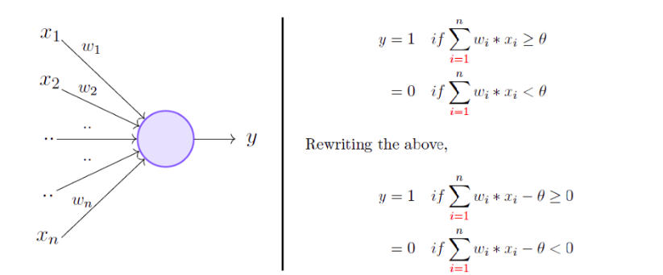
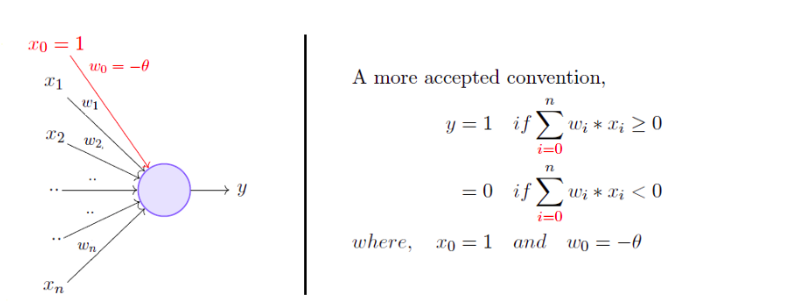
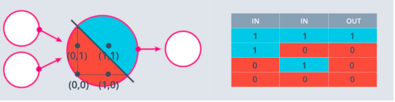
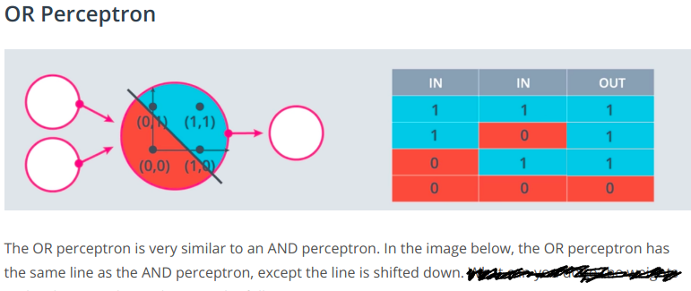
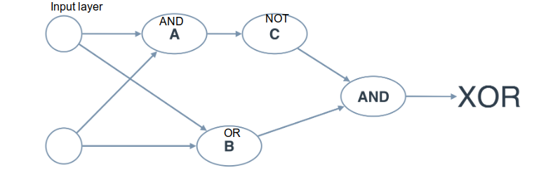
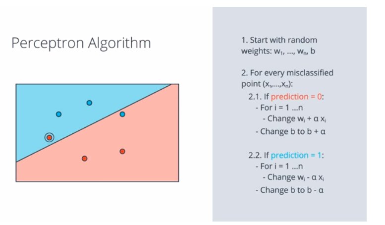

### Perceptron -- For linearly separable data

 * The most fundamental unit of a deep neural network is called an artificial neuron/perceptron, which takes an input, processes it, passes it through an activation function like the Sigmoid, return the activated output.

 * The perceptron model, proposed by Minsky-Papert  We take a weighted sum of the inputs and set the output as one only when the sum is more than an arbitrary threshold, $\theta$. However, according to the convention, instead of hand coding the thresholding parameter $\theta$, we add it as one of the inputs, with the weight -$\theta$ like shown below, which makes it learnable. w_0 is called the bias.

 * A perceptron separates the input space into two halves, positive and negative. All the inputs that produce an output 1 lie on one side (positive half space) and all the inputs that produce an output 0 lie on the other side (negative half space).**So, a single perceptron can only be used to implement linearly separable functions.**

 * **The perceptron algorithm is an algorithm for supervised learning of binary classifiers. Perceptron is a type of linear classifier, i.e. a classification algorithm that makes all of its predictions based on a linear predictor function combining a set of weights with the feature vector.** The job of a perceptron is to learn linear decision boundary (n-1 dimensional hyperplane) i.e. it has to learn a model, given by  $w_{1}x_{1} + w_{2}x_{2}+ ...+ w_{n}x_{n} + b$, so that $\hat{y}$(our predicion) resembles y(actual labels) as close as possible on training data.**Mind you that Perceptron is not a Sigmoid neuron and we’re not going to do any Gradient Descent.**

 * Perceptrons as Logical Operators    **A single perceptron cannot learn to separate the data that are non-linear in nature.**

 * Perceptron Algorithm  We just repeat the above algorithm until the number of errors is small or we could run the algorithm just say, 1000 times(epochs) and stop.

References:
 * [Introduction to Perceptron](https://towardsdatascience.com/perceptron-the-artificial-neuron-4d8c70d5cc8d)
 * [Perceptron Learning Algorithm](https://towardsdatascience.com/perceptron-learning-algorithm-d5db0deab975)
 * [Another good post](https://dzone.com/articles/introduction-to-perceptron-neural-network)
