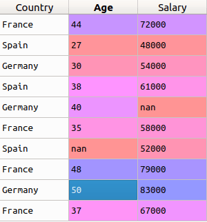
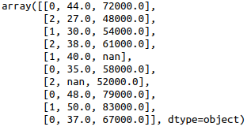
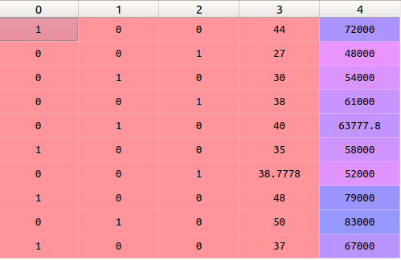

## Sigmoid Neuron and other useful points
**Why move from Perceptron to Sigmoid neuron ?**
 --- I don't understand the reason precisely for now. But let's discuss Sigmoid Neuron.

 * Sigmoid Neuron is like a perceptron, except the inputs $x_1,x_2,…$ instead of being just 0 or 1, can also take on any values between 0 and 1. So, for instance, 0.638… is a valid input for a sigmoid neuron, and similarly the output is not just 0 or 1. Instead, it's $σ(w⋅x+b)$, where σ is called the sigmoid function, and is defined by:
                 $σ(z)=\frac{1}{1+e^{−z}}$
  σ is sometimes called the logistic function, and this new class of neurons called logistic neurons. It's useful to remember this terminology, since these terms are used by many people working with neural nets. However, we'll stick with the sigmoid terminology.

 * To put it all a little more explicitly, the output of a sigmoid neuron with inputs $x_1,x_2,…,$ weights $w_{1},w_{2},…,$ and bias b is:=$\frac{1}{1+e^{(−\sum_{j}w_jx_j−b)}}$

#### The Softmax Function
The softmax function is equivalent of the sigmoid activation function, but when the problem has 3 or more classes.

**Softmax for n=2 classes is same as the sigmoid function.** Think about it, looks like an simple statement but has important details.

### Maximum Likelihood
Simply put, what should be the values of parameters such that the probability of particular event is maximum.
Now, we want to pick the model(or hypothesis, or $w_1*x_1 + w_2*x_2 + ...+ w_n*x_n + b$) that gives existing labels the highest probability. Thus by maximizing the probability we can pick the best possible model. 

Error function is a function which simply tells how far are we from the solution.
 [Realtion between Error function and probability](https://www.youtube.com/watch?v=-xxrisIvD0E)  [Product of probabilities](https://www.youtube.com/watch?time_continue=22&v=njq6bYrPqSU)
 * Maximising the product of probabilities can lead to very very tiny numbers so we take the negative log of product which changes our goal, from maximizing the probability to minimizing the cross entropy.

 * Cross-entropy loss, or log loss, measures the performance of a classification model whose output is a probability value between 0 and 1. A good model will give a low cross entropy and a bad model will give a high cross entropy.
 * In binary classification, where the number of classes N equals 2, cross-entropy loss can be calculated as:$-{(y\log(p) + (1 - y)\log(1 - p))}$  
 If $N>2$ (i.e. multiclass classification), we calculate a separate loss for each class label per observation and sum the result:
 $-\sum_{c=1}^Ny_{o,c}\log(p_{o,c})$
     * N - number of classes
     * log - the natural log
     * y - binary indicator (0 or 1) if class label c is the correct classification for observation o. **This is a key feature of multiclass logloss, it rewards/penalises probabilities of correct classes only. The value is independent of how the remaining probability is split between incorrect classes.**
     * p - predicted probability observation o is of class c.

Cross entropy loss function averaged over all training examples becomes a cross entropy cost function.

### One hot encoding
 * Categorical variables(or features) are variables that contain categories rather than numeric values. The number of possible categories is often limited to a fixed set. Example:  
   
 The first column is all text.  Many ML algorithms cannot operate on text data directly. They require all input variables and output variables to be numeric, which means that categorical data must be converted to a numerical form. There are two ways to do that:
   * Label Encoding --   The problem here is, since there are different numbers in the same column, the model will misunderstand the data to be in some kind of order, 0 < 1 < 2, precisely **it will assume higher the categorical value, better the category,** which implies Germany > Spain > France. But this isn’t the case at all. To overcome this problem, we use One Hot Encoding.

   * One-hot Encoding -- One hot encoding is a process by which categorical variables are converted into a form that could be provided to ML algorithms to do a better job in prediction. What one hot encoding does is, it takes a column which has categorical data, which has been label encoded, and then splits the column into multiple columns. The numbers are replaced by 1s and 0s, depending on which column has what value. In our example, we’ll get three new columns, one for each country — France, Germany, and Spain. 
