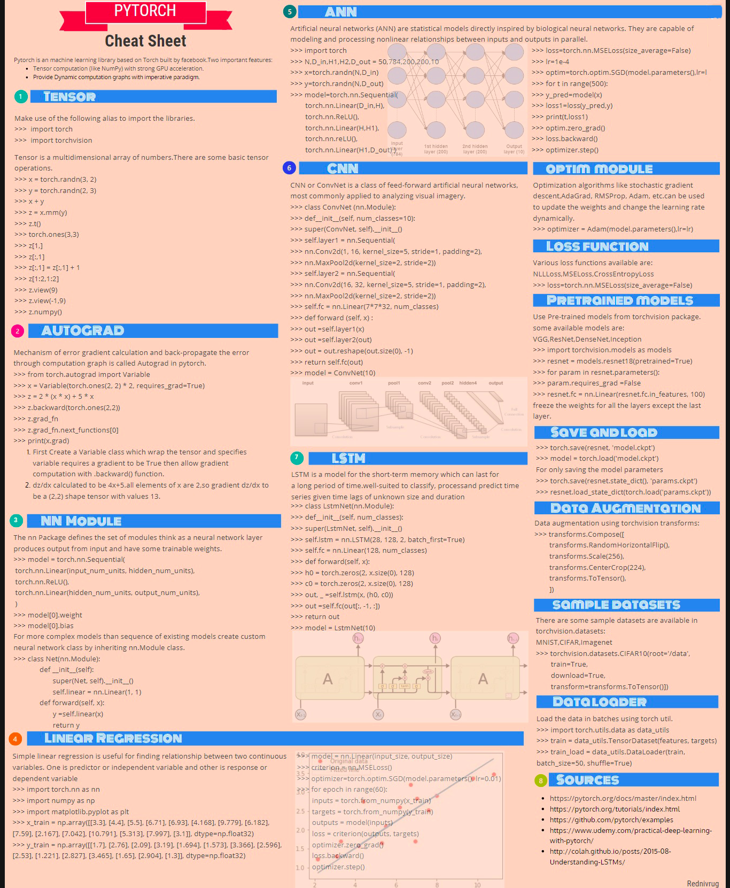

## Udacity Project Review

Please find the pointers to interesting articles on applications of LSTM's

* Language translation: https://chunml.github.io/ChunML.github.io/project/Sequence-To-Sequence/
* Sequence tagging: https://www.depends-on-the-definition.com/sequence-tagging-lstm-crf/
* And a link to the deep learning dictionary: https://towardsdatascience.com/the-deep-learning-ai-dictionary-ade421df39e4

##### PyTorch cheatsheet: 
